# ELECTRICAL BUILD — THE DESIGN

**1982 Mazda RX-7 (FB) · 12A / Weber · automatic · full replacement of the factory electrical system.**

This document is the complete design. Everything a reviewer needs to validate it is in this folder: this file, the drawings in `diagrams/`, and the three data tables in `data/` that every table below is printed from. It contains no purchasing information and no build sequence — those live in their own sections and are derived from this one.

## What the system is

An ECUMaster PMU-24 DL solid-state power module replaces the factory fuse box, relays, flasher and control unit. Every load in the car is switched by one of its 22 outputs and protected by a software current limit on that output. Every switch in the car is read as a resistor ladder on one wire into one of its analog inputs, so no switch carries load current. A rear-mounted lithium battery feeds the module through a Class-T fuse over a single 2 AWG cable; the starter has its own cable off the battery post. Four harness legs leave a removable dash plate through Deutsch connectors, cut by what comes out of the car as one piece. The factory instrument cluster stays and is fed from day one. Everything the car may gain later — power windows, mirrors, heated seats, a climate module, a digital cluster, a control panel — has its wire run now, terminated and capped, so no future project reopens the interior.

## Scope

| In this design | Not in this design |
|---|---|
| Battery relocation and the power backbone | Any luxury-package hardware — window motors, mirrors, seat heaters, climate module, digital cluster, control panel, LED lamps, A/C |
| The PMU, its plate, relays, fuses, wake circuit | The design of those future subsystems — only their conductors appear here, as capped wires |
| Four harness legs, the sill node, five dash-post drops | Audio signal wiring (the amplifier's power feed and ground are here; speaker and RCA runs are not) |
| Every switch, ladder, sender and lamp the car needs to drive, day and night, in rain | The LS engine swap — its outputs, CAN drop and sensor cavities are reserved and capped |
| The factory cluster, fed from the new harness |  |

**Status words used throughout:** **LIVE** — wired, connected, enabled. **CAPPED** — wire run, terminated in its cavity, far end sealed and labelled. **PLUG** — engine-leg cavity fitted with a sealing plug and no wire. **EMPTY** — relay socket or fuse holder fitted and labelled with nothing in it.


---

## 1 · The system in one picture

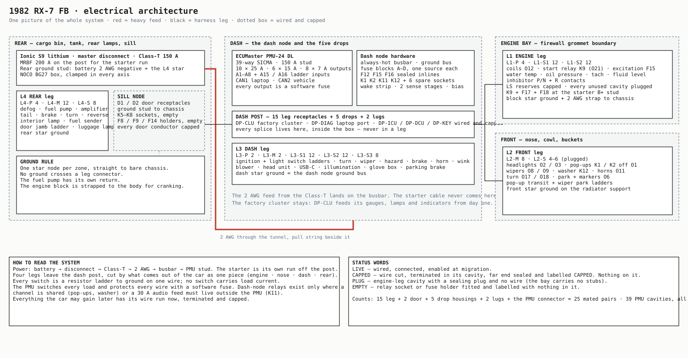

| Element | Count |
|---|---|
| PMU outputs used | 22 of 22 (10 × 25 A · 6 × 15 A · 6 × 7 A) — O13 / O14 reserved for the swap, disabled |
| PMU analog inputs used | 10 — A1–A8 dedicated, A15 / A16 on the shared 7 A pins |
| Harness legs | 4 — L1 engine · L2 front · L3 dash · L4 rear (with the sill sub-node) |
| Leg housings | 15 (L1-S is two housings) + 2 door + 5 dash-post drops + 2 lugs + the PMU connector = **25 mated pairs** |
| Relays | 4 fitted on the plate (K1 K2 K11 K12) + K9 in the engine bay · 6 empty sockets (2 plate, 4 sill) |
| Fuses | 11 fitted on the plate + 2 in the engine bay + Class-T + MRBF · 7 empty labelled positions |
| Ground nodes | 5 — engine block · front · dash (plate) · rear · sill |

---

## 2 · Power backbone

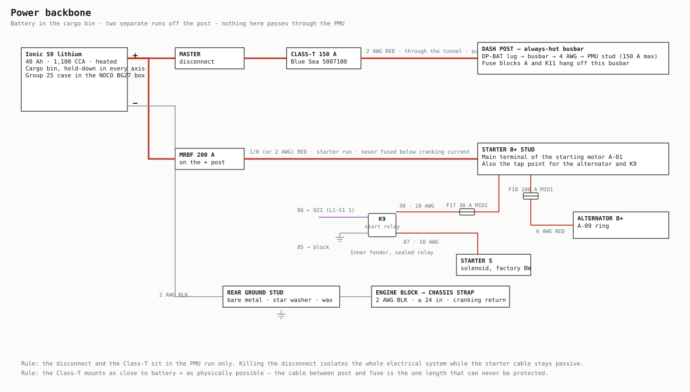

The Ionic S9 (LiFePO4, 40 Ah, 1,100 CCA, built-in heater, Group 25 case) sits in the cargo bin in a NOCO BG27 box, clamped against g-load in every axis over a backing plate. Two runs leave the positive post and they never share a fuse:

| Run | Cable | Protection | Why |
|---|---|---|---|
| Battery + → master disconnect → Class-T → dash post busbar | 2 AWG fine-strand, loomed, grommeted, pull string beside it in the tunnel | Class-T 150 A at the battery — the PMU stud's maximum | Class-T is the only common fuse with the interrupt rating to break a lithium short. The disconnect kills the whole electrical system while the starter cable stays passive |
| Battery + → MRBF → starter B+ stud | 1/0 (or 2 AWG), loomed | MRBF 200 A on the post | Cranking pulls 300–500 A for a moment; it cannot pass through the 150 A Class-T |
| Starter B+ stud → alternator B+ | 6 AWG | F18 100 A MIDI at the stud | The alternator charges through the starter cable, as the factory did through its fusible link |
| Starter B+ stud → K9 contact 30 | 10 AWG | F17 30 A MIDI at the stud | The start relay's contact current never touches the PMU; O21 only drives the coil |
| Battery − → rear ground stud | 2 AWG | — | Bare metal, star washer, cavity wax |
| Engine block → chassis | 2 AWG strap, ≤ 24 in | — | The cranking return. Without it the current finds its own path through throttle cables and sender wires |

At the dash post the 2 AWG lands directly on the always-hot busbar. The busbar feeds the PMU stud over a 4 AWG jumper of a few inches and, through fuse block A and relay K11, the handful of loads that must live outside the PMU (§5).


---

## 3 · Protection schedule

**Two layers.** Every PMU output is a software current limit that protects the wire from that pin to the device. Where one output feeds several branches through a bus, each branch gets a blade fuse so a fault on one branch cannot take the others down. The heavy cables are fused at their source.

| Fuse | Rating | Where | Feeds | Fed from | State |
|---|---|---|---|---|---|
| Class-T | 150 A | Cargo bin, at battery + | The whole PMU system — 2 AWG to the dash post | Battery + (through the master disconnect) | LIVE |
| MRBF | 200 A | Cargo bin, on battery + | Starter main cable (1/0) | Battery + | LIVE |
| F1 | 15 A | Plate, block B (K11) | Head unit memory / constant — L3-M 2 | K11 87 | LIVE |
| F2 | 2 A | Plate, block A (busbar) | Diagnostic port +12 V — DP-DIAG 3 | Busbar | LIVE |
| F3 | 5 A | Plate, block A (busbar) | Switch supply — ignition switch, light switch, wake stages — L3-S2 2 | Busbar | LIVE |
| F5 | 30 A | Plate, block B (K11) | Amplifier constant — L4-P 4 | K11 87 | LIVE |
| F6 | 10 A | Plate, block C (O1) | Pop-up LH — K1 contact 30 | O1 | LIVE |
| F7 | 10 A | Plate, block C (O1) | Pop-up RH — K2 contact 30 | O1 | LIVE |
| F8 | — | Sill plate, sealed inline | Window branch DRV — holder fitted, no fuse | O1 via L4-P 3 (capped) | EMPTY |
| F9 | — | Sill plate, sealed inline | Window branch PASS — holder fitted, no fuse | O1 via L4-P 3 (capped) | EMPTY |
| F10 | — | Plate, block D (O15) | Comfort — position fitted, no fuse | O15 | EMPTY |
| F11 | — | Plate, block D (O15) | Comfort — position fitted, no fuse | O15 | EMPTY |
| F12 | 5 A | Plate, sealed inline | Interior lamp — L4-M 8 | O20 | LIVE |
| F13 | — | Plate, block A (busbar) | Future module — position labelled, no fuse | Busbar | EMPTY |
| F14 | — | Sill plate, sealed inline | Mirror heat — holder fitted, no fuse | (unconnected) | EMPTY |
| F15 | 7.5 A | Plate, sealed inline | Alternator excitation — L1-S1 2 | O12 | LIVE |
| F16 | 5 A | Plate, sealed inline | Factory cluster IG feed — DP-CLU 1 | O12 | LIVE |
| F17 | 30 A | Engine bay, MIDI holder at the starter B+ stud | Start relay K9 contact 30 (10 AWG) | Starter B+ stud | LIVE |
| F18 | 100 A | Engine bay, MIDI holder at the starter B+ stud | Alternator B+ cable (6 AWG) | Starter B+ stud ← alternator | LIVE |
| F19 | 3 A | Plate, block A (busbar) | Courtesy lamps — glove box (L3-S2 10) + luggage (L4-S 8) | Busbar | LIVE |

### Fuse blocks on the plate — one source per block

| Block | Input | Position 1 | Position 2 | Position 3 | Position 4 |
|---|---|---|---|---|---|
| Block A | Always-hot busbar | F2 2 A | F3 5 A | F19 3 A | F13 (empty) |
| Block B | K11 87 (audio master) | F1 15 A | F5 30 A | spare | spare |
| Block C | O1 motor bus | F6 10 A | F7 10 A | spare | spare |
| Block D | O15 comfort bus | F10 (empty) | F11 (empty) | spare | spare |

F12, F15 and F16 are sealed inline holders on the plate; F8, F9 and F14 are sealed inline holders on the sill plate; F17 and F18 are bolt-down MIDI holders beside the starter stud.


### Software limits — the rule

A limit is set from a measured figure, never from an estimate. Motors: measured stall × 1.10. Filament lamps: measured steady × 1.35 plus an inrush window (a cold filament pulls 8–12× for a few milliseconds). Resistive: measured cold × 1.20. Electronics: measured steady × 1.50. Round up to 0.5 A. Until a channel has been measured it runs at its channel cap — the limit still protects the wire, because every wire is sized above its channel — and the PMU's own current telemetry provides the measurement in the first week of driving, after which each limit is tightened. The values in §4 are the enable-at values.


---

## 4 · The PMU — every pin

**Device:** ECUMaster PMU-24 DL. 39-way SICMA connector, 150 A stud. Outputs: O1–O5 and O12–O16 25 A · O6–O11 15 A · O17–O24 7 A. O1 and O16 carry integrated flyback diodes; O8 has wiper-motor braking. A1–A8 are dedicated 0–5 V 10-bit inputs; A9–A16 share the O17–O24 pins, 0–20 V 12-bit. CAN1 is fixed at 1 Mbps with no internal termination; CAN2 has software termination.

**Terminals:** 2.8 mm large `211CC3S3120` for the ten 25 A outputs and ground (10–12 AWG) · 2.8 mm `211CC3S2120` for pin 15 (14–16 AWG) · 1.5 mm `211CC2S2160P` for everything else (14–17 AWG). **Signal wire is 16 AWG. 14 AWG is the heaviest a 15 A output can take.**


### 4.1 · Pin allocation

| Pin | Cav | Ch | Name | AWG | Colour | Circuit | Goes to | Est A | Enable at | Inrush | State |
|---|---|---|---|---|---|---|---|---|---|---|---|
| STUD | stud | — | `+12V BATT` | 2 | RED | Main supply from the Class-T, 150 A max | Busbar → PMU stud | — | — | — | LIVE |
| 25 | L | — | `GND` | 10 | BLK | Device ground and flyback return for every inductive load | GND bus, ≤ 6 in | — | — | — | LIVE |
| 7 | S | — | `+12V SW` | 16 | BLU | Wake input — diode-OR strip: ACC · RUN · door stage (A6) · horn/hazard/wink stage (A8) · O22 latch | Wake strip common rail | — | — | — | LIVE |
| 15 | M | — | `+5V OUT` | 16 | PNK | +5 V reference — plate only: the two 100 kΩ bias resistors for A15 / A16 | Bias resistors on the plate | — | — | — | LIVE |
| 23 | S | — | `CAN1H` | 16 tw | YEL | Laptop / config bus, 1 Mbps. 120 Ω at BOTH ends (PMU end + port) | DP-DIAG 1 | — | — | — | LIVE |
| 36 | S | — | `CAN1L` | 16 tw | GRN | Laptop / config bus | DP-DIAG 2 | — | — | — | LIVE |
| 24 | S | — | `CAN2H` | 16 tw | YEL/BLK | Vehicle bus 500 kbps — software termination ON at the PMU, 120 Ω at the engine-bay drop | L1-S1 9 · DP-ICU 3 · DP-DCU 4 · DP-KEY 1 | — | — | — | LIVE |
| 37 | S | — | `CAN2L` | 16 tw | GRN/BLK | Vehicle bus | L1-S1 10 · DP-ICU 4 · DP-DCU 5 · DP-KEY 2 | — | — | — | LIVE |
| 38 | L | O1 | `MOTOR_BUS` | 12 | RED/WHT | Pop-up motor bus — feeds fuse block C (F6 / F7 → K1 / K2 contacts) and both K1 / K2 coils | Block C in · K1 86 · K2 86 · L4-P 3 (capped) | 9.5 | 25.0 cap | 7× 400 ms | LIVE |
| 39 | L | O2 | `HEAD_LOW` | 12 | RED/BLK | Headlight LOW, both lamps | L2-P1 1 | 3.0 | 25.0 cap | 3× 200 ms | LIVE |
| 26 | L | O3 | `HEAD_HIGH` | 12 | RED/BRN | Headlight HIGH, both lamps + the cluster high-beam indicator | L2-P1 2 · DP-CLU 12 | 3.5 | 25.0 cap | 3× 200 ms | LIVE |
| 13 | L | O4 | `DEFOG` | 12 | RED/GRN | Rear defog grid — wired; channel configured and DISABLED (no control surface in this build) | L4-P 1 | 11.5 | 25.0 cap | 1.3× 2000 ms | LIVE |
| 12 | L | O5 | `FUEL_PUMP` | 12 | RED/YEL | Fuel pump — Carter P4070 | L4-P 2 | 2.0 | **4.0 meas** | 3× 150 ms | LIVE |
| 2 | L | O12 | `IGNITION` | 12 | RED/BLU | Ignition — coils and igniters; also the F15 alternator-excitation branch and the F16 cluster branch | L1-P 1 · F15 · F16 | 5.0 | 25.0 cap | 2× 100 ms | LIVE |
| 1 | L | O13 | `LS_ECU` | 12 | RED/ORN | Reserved for the LS swap — ECU + injectors | L1-P 2 (capped) | — | — | — | CAPPED |
| 14 | L | O14 | `LS_FAN` | 12 | RED/GRY | Reserved for the LS swap — cooling fan | L1-P 3 (capped) | — | — | — | CAPPED |
| 27 | L | O15 | `COMFORT` | 12 | RED/VIO | Comfort bus — fuse block D (F10 / F11, empty) and the capped dash feed. No live load this build | Block D in · L3-P 2 (capped) | — | — | — | LIVE |
| 28 | L | O16 | `BLOWER` | 12 | RED/PNK | Blower motor (new motor — speed selected by the resistor pack and switch on the ground side) | L3-P 1 | 15.0 | 25.0 cap | 8× 600 ms | LIVE |
| 11 | S | O6 | `TAIL_PARK` | 14 | ORN/BRN | Tail · park · side markers · licence | L2-M 7 · L4-M 1 | 4.4 | **7.5 meas** | 10× 100 ms | LIVE |
| 10 | S | O7 | `BRAKE` | 14 | ORN/GRN | Brake lamps | L4-M 2 | 3.9 | **9.5 meas** | 10× 100 ms | LIVE |
| 9 | S | O8 | `WIPE_LOW` | 14 | ORN/BLU | Wiper LOW brush — braking channel; also feeds K12 (washer) contact 30 | L2-M 1 · K12 30 | 4.0 | 15.0 cap | 7× 300 ms | LIVE |
| 5 | S | O9 | `WIPE_HIGH` | 14 | ORN/WHT | Wiper HIGH brush | L2-M 2 | 5.5 | 15.0 cap | 7× 300 ms | LIVE |
| 4 | S | O10 | `ACCESSORY` | 14 | ORN/YEL | Accessory bus — head unit (ACC), USB-C, K12 coil; three capped module drops | L3-M 1 · K12 86 · DP-ICU 1 · DP-DCU 1 · DP-KEY 3 (capped) | 2.5 | 15.0 cap | 2× 100 ms | LIVE |
| 3 | S | O11 | `HORN` | 14 | ORN/BLK | Horns, both | L2-M 3 | 6.0 | 15.0 cap | 3× 80 ms | LIVE |
| 6 | S | O17 | `TURN_L` | 16 | VIO/GRN | Turn LEFT front + rear + cluster indicator — flashed in the PMU | L2-M 5 · L4-M 5 · DP-CLU 10 | 4.2 | **4.5 meas** | 10× 100 ms | LIVE |
| 33 | S | O18 | `TURN_R` | 16 | VIO/YEL | Turn RIGHT front + rear + cluster indicator | L2-M 6 · L4-M 6 · DP-CLU 11 | 4.2 | **4.5 meas** | 10× 100 ms | LIVE |
| 20 | S | O19 | `REVERSE` | 16 | VIO/BLK | Reverse lamps | L4-M 7 | 3.9 | 7.0 cap | 10× 100 ms | LIVE |
| 34 | S | O20 | `INTERIOR` | 16 | VIO/WHT | Interior lamp (via F12, PWM theatre fade) + illumination bus (dash lamps, cluster, head unit) | F12 → L4-M 8 · L3-S1 8 · DP-CLU 3 · DP-ICU 5 (capped) | 2.5 | 7.0 cap | 10× 100 ms | LIVE |
| 21 | S | O21 | `START_RLY` | 16 | VIO/RED | Start relay K9 coil | L1-S1 1 | 0.2 | 7.0 cap | 2× 50 ms | LIVE |
| 8 | S | O22 | `KEEP_ALIVE` | 16 | VIO/BLU | Keep-alive — feeds the wake strip through a diode and drives K11 (audio master) | Wake strip input 5 · K11 86 | 0.2 | 7.0 cap | 2× 0 ms | LIVE |
| 35 | S | A15 | `HEADLIGHT_SW` | 16 | GRY/WHT | Headlight switch ladder — OFF / PARK / HEAD-LO / HEAD-HI / PASS (12 V side, 12-bit) | L3-S1 2 | — | — | — | LIVE |
| 22 | S | A16 | `KEY_POS` | 16 | GRY/RED | Key ladder — OFF / ACC / RUN / START (summed, 12 V side, 12-bit) | L3-S1 1 | — | — | — | LIVE |
| 29 | S | A1 | `TURN_STALK` | 16 | GRY/GRN | Turn stalk — LEFT / OFF / RIGHT | L3-S1 3 | — | — | — | LIVE |
| 16 | S | A2 | `WIPER_STALK` | 16 | GRY/BLU | Wiper stalk — WASH / HIGH / LOW / INT / OFF | L3-S1 4 | — | — | — | LIVE |
| 30 | S | A3 | `BRAKE_PARK` | 16 | GRY/ORN | Brake pedal + wiper park sense — 4 states | L3-S1 5 · L2-S 3 (spliced at the post) | — | — | — | LIVE |
| 17 | S | A4 | `POPUP_L` | 16 | GRY/BLK | Pop-up LEFT transit contact + inhibitor P/N contact | L2-S 1 · L1-S1 11 (spliced at the post) | — | — | — | LIVE |
| 31 | S | A5 | `POPUP_R` | 16 | GRY/BRN | Pop-up RIGHT transit contact + inhibitor R contact | L2-S 2 · L1-S2 7 (spliced at the post) | — | — | — | LIVE |
| 18 | S | A6 | `DOOR_PINS` | 16 | GRY/VIO | Door jamb switches, driver + passenger — 4 states | L4-S 2 | — | — | — | LIVE |
| 32 | S | A7 | `FUEL_LEVEL` | 16 | GRY/YEL | Fuel sender tap — the factory gauge drives the sender; the PMU only reads the node | Tap on the L4-S 1 → DP-CLU 7 conductor | — | — | — | LIVE |
| 19 | S | A8 | `HAZ_HORN_WINK` | 16 | GRY/PNK | Hazard · horn · wink L · wink R — one summed ladder | L3-S1 6 · L3-S1 11 (spliced at the post) | — | — | — | LIVE |

**Cav:** L = large 2.8 mm cavity · M = 2.8 mm (pin 15 only) · S = 1.5 mm. **Enable at:** the software limit typed in before the channel is first enabled — *meas* is a measured figure, *cap* is the channel cap pending telemetry.


### 4.2 · Connector geometry, looking at the device

```
   1:O13    2:O12    3:O11    4:O10    5:O9     6:O17    7:+12V   8:O22    9:O8    10:O7    11:O6    12:O5    13:O4      ← row 1
  14:O14   15:+5V   16:A2    17:A4    18:A6    19:A8    20:O19   21:O21   22:A16   23:CAN1H 24:CAN2H 25:GND   26:O3      ← row 2
  27:O15   28:O16   29:A1    30:A3    31:A5    32:A7    33:O18   34:O20   35:A15   36:CAN1L 37:CAN2L 38:O1    39:O2      ← row 3
```

Pin 1 is top-left with the purple lock on the right and the connector face toward you. Each row is 2 large · 9 small · 2 large; the large cavities are 1, 2, 12, 13, 14, 15, 25, 26, 27, 28, 38, 39. Enclosure 131 × 112.1 × 32.5 mm, three Ø6.5 mm mounts, connector on the short edge, stud opposite. Leave a clear arc for the lever.


### 4.3 · Wire colour code

Base colour says what kind of circuit a wire is; the tracer says which one. A wire can be identified without a drawing.

| Base | Meaning | AWG |
|---|---|---|
| **RED** | 25 A output; busbar and K11 constants; heavy feeds | 12 (2 / 4 / 6 / 10 for the backbone) |
| **ORN** | 15 A output | 14 |
| **VIO** | 7 A output | 16 |
| **GRY** | Analog input — ladders, senders, lamp-sense | 16 |
| **BLU** | Wake sources and relay coil returns | 16 |
| **PNK** | Switch supply from F3 (+12 V always) and the +5 V bias on the plate | 16 |
| **YEL / GRN** | CAN high / low — BLK tracer = CAN2 | 16 twisted |
| **BLK** | Ground | 10 at the nodes, 12–16 at the devices |

This is **not** the factory scheme. Factory colours are two-letter codes (first letter base, second tracer; `GY` is green/yellow, not grey) and appear in this document only to identify the terminal a new wire lands on.


---

## 5 · The plate

A removable 3 mm aluminium backer in the dash carries the PMU, the always-hot busbar, the ground bus, four single-source fuse blocks, three sealed inline fuses, ten relay sockets (four populated), the wake strip with its two sense stages, the two bias resistors, and the receptacle for every leg and drop. Nothing on the plate is spliced anywhere else; every splice in the car is either at the post (inside the box) or at a device.

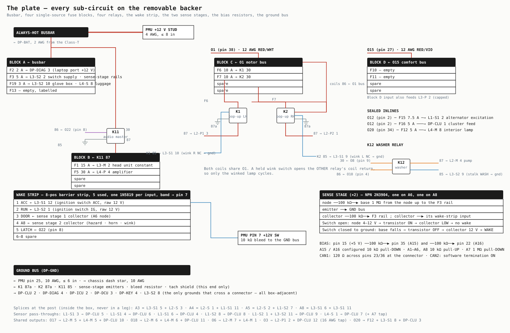


### 5.1 · Relays

| Relay | Function | Type | Where | Coil | Contacts | State |
|---|---|---|---|---|---|---|
| K1 | Pop-up LH run | ISO micro SPDT 40 A, integral diode | Plate | 86 ← O1 · 85 → L3-S1 10 (wink R NC → ground) | 30 ← F6 · 87 → L2-P1 3 · 87a → GND bus (dynamic brake) | LIVE |
| K2 | Pop-up RH run | ISO micro SPDT 40 A, integral diode | Plate | 86 ← O1 · 85 → L3-S1 9 (wink L NC → ground) | 30 ← F7 · 87 → L2-P2 1 · 87a → GND bus | LIVE |
| K3 | — empty socket | — | Plate | — | — | SPARE |
| K4 | — empty socket | — | Plate | — | — | SPARE |
| K5 | Window DRV up — empty socket | — | Sill plate | — | — | SPARE |
| K6 | Window DRV down — empty socket | — | Sill plate | — | — | SPARE |
| K7 | Window PASS up — empty socket | — | Sill plate | — | — | SPARE |
| K8 | Window PASS down — empty socket | — | Sill plate | — | — | SPARE |
| K9 | Start relay | Sealed mini ISO SPDT, integral diode, weatherproof socket | Inner fender, engine bay | 86 ← L1-S1 1 (O21) · 85 → block ground | 30 ← F17 (starter B+ stud, 10 AWG) · 87 → starter solenoid S terminal (10 AWG) | LIVE |
| K11 | Audio master (constant bus) | ISO micro SPDT 40 A, integral diode | Plate | 86 ← O22 · 85 → GND bus | 30 ← busbar (10 AWG) · 87 → block B input (10 AWG) | LIVE |
| K12 | Washer pump | ISO micro SPDT 40 A, integral diode | Plate | 86 ← O10 · 85 → L3-S2 9 (stalk WASH contact → ground) | 30 ← O8 · 87 → L2-M 4 | LIVE |

### 5.2 · Wake circuit

Pin 7 (+12V SW) turns the PMU on. Five sources feed it through one 1N5819 Schottky each on an 8-position barrier strip, with a 10 kΩ bleed from the rail to ground so leakage can never hold the module awake: **ACC** and **RUN** from the ignition switch (raw 12 V, one conductor each), **the door node** and **the horn/hazard/wink node** through the two sense stages, and **O22**, the PMU's own keep-alive latch. The strip has three spare positions.


Two identical NPN sense stages on the plate (2N3904 / 2N2222 class), one on the A6 node and one on the A8 node. Base ← node through 100 kΩ · 1 MΩ from the node to the F3 rail · emitter → GND bus · collector → 100 kΩ to the F3 rail and → its wake-strip diode. Node idle (open switch): the node sits at ~4–12 V, the transistor is ON, the collector is LOW — no wake. Any switch on that node closes to ground: base falls, transistor OFF, collector rises to 12 V through the pull-up — wake. The 1 MΩ injects ~7 µA into the ladder while awake (about 1.5 ADC counts); the decode windows absorb it.


O22 (`KEEP_ALIVE`) lets the PMU finish its own shutdown — the interior-lamp fade, saving state — then release pin 7 and sleep. It also drives K11, so the audio constants drop when the car sleeps and the sleeping draw is the PMU's own 150 mA plus nothing.


### 5.3 · Every conductor on the plate

| From | To | AWG | Colour | Note |
|---|---|---|---|---|
| DP-BAT lug (2 AWG from the Class-T) | Always-hot busbar stud | 2 | RED | The main feed lands directly on the busbar |
| Always-hot busbar | PMU +12 V stud | 4 | RED | ≤ 8 in, ring lugs both ends, torque to spec |
| Always-hot busbar | Fuse block A input | 10 | RED |  |
| Always-hot busbar | K11 terminal 30 | 10 | RED |  |
| K11 terminal 87 | Fuse block B input | 10 | RED |  |
| K11 terminal 86 | PMU pin 8 (O22) — tapped at the wake-strip input 5 | 16 | VIO/BLU |  |
| K11 terminal 85 | GND bus | 16 | BLK |  |
| PMU pin 38 (O1) | Fuse block C input | 12 | RED/WHT |  |
| Fuse block C, F6 out | K1 terminal 30 | 12 | RED/WHT |  |
| Fuse block C, F7 out | K2 terminal 30 | 12 | RED/WHT |  |
| Fuse block C input | K1 terminal 86 and K2 terminal 86 | 16 | RED/WHT | Coils fed straight from the O1 bus |
| K1 terminal 85 | Receptacle L3-S1 10 | 16 | BLU/YEL | Wink R NC pole closes this to ground |
| K2 terminal 85 | Receptacle L3-S1 9 | 16 | BLU/GRN | Wink L NC pole closes this to ground |
| K1 terminal 87 | Receptacle L2-P1 3 | 12 | RED/WHT |  |
| K2 terminal 87 | Receptacle L2-P2 1 | 12 | RED/WHT |  |
| K1 terminal 87a | GND bus | 12 | BLK | Dynamic braking at rest |
| K2 terminal 87a | GND bus | 12 | BLK |  |
| Fuse block C input | Receptacle L4-P 3 | 12 | RED/WHT | Capped window bus — terminated, no load |
| PMU pin 27 (O15) | Fuse block D input | 12 | RED/VIO |  |
| Fuse block D input | Receptacle L3-P 2 | 12 | RED/VIO | Capped comfort feed |
| PMU pin 2 (O12) | Receptacle L1-P 1 | 12 | RED/BLU |  |
| PMU pin 2 (O12) tap | F15 inline (7.5 A) → receptacle L1-S1 2 | 16 | RED/BLU | Alternator excitation |
| PMU pin 2 (O12) tap | F16 inline (5 A) → receptacle DP-CLU 1 | 16 | RED/BLU | Cluster feed |
| PMU pin 34 (O20) | F12 inline (5 A) → receptacle L4-M 8 | 16 | VIO/WHT | Interior lamp |
| PMU pin 34 (O20) tap | Receptacles L3-S1 8, DP-CLU 3, DP-ICU 5 (capped) | 16 | VIO/WHT | Illumination bus |
| PMU pin 4 (O10) | Receptacle L3-M 1 | 14 | ORN/YEL |  |
| PMU pin 4 (O10) tap | K12 terminal 86; receptacles DP-ICU 1, DP-DCU 1, DP-KEY 3 (capped) | 16 | ORN/YEL |  |
| K12 terminal 85 | Receptacle L3-S2 9 | 16 | BLU/GRY | Stalk WASH contact closes this to ground |
| PMU pin 9 (O8) | Receptacle L2-M 1 and K12 terminal 30 | 14 | ORN/BLU |  |
| K12 terminal 87 | Receptacle L2-M 4 | 14 | ORN/VIO | Washer pump |
| Fuse block A, F2 out | Receptacle DP-DIAG 3 | 16 | RED |  |
| Fuse block A, F3 out | Receptacle L3-S2 2; wake-stage pull-ups (emitter rail) | 16 | PNK | Switch supply |
| Fuse block A, F19 out | Receptacles L3-S2 10 and L4-S 8 | 16 | RED | Courtesy lamps |
| Fuse block B, F1 out | Receptacle L3-M 2 | 14 | RED | Head unit constant |
| Fuse block B, F5 out | Receptacle L4-P 4 | 12 | RED | Amplifier |
| Receptacle L3-S1 12 | Wake strip input 1 (ACC) | 16 | BLU/WHT |  |
| Receptacle L3-S2 1 | Wake strip input 2 (RUN) | 16 | BLU |  |
| Wake stage 1 collector (A6 door) | Wake strip input 3 | 16 | BLU |  |
| Wake stage 2 collector (A8 horn/hazard/wink) | Wake strip input 4 | 16 | BLU |  |
| PMU pin 8 (O22) | Wake strip input 5 | 16 | VIO/BLU |  |
| Wake strip common rail (after the five 1N5819) | PMU pin 7 (+12V SW) | 16 | BLU | 10 kΩ bleed from this rail to the GND bus |
| PMU pin 15 (+5 V) | 100 kΩ → PMU pin 35 (A15) · 100 kΩ → PMU pin 22 (A16) | 16 | PNK | Bias so a broken wire reads 0, not OFF |
| PMU pin 17 (A4) | Receptacles L2-S 1 and L1-S1 11 (splice) | 16 | GRY/BLK |  |
| PMU pin 31 (A5) | Receptacles L2-S 2 and L1-S2 7 (splice) | 16 | GRY/BRN |  |
| PMU pin 30 (A3) | Receptacles L3-S1 5 and L2-S 3 (splice) | 16 | GRY/ORN |  |
| PMU pin 19 (A8) | Receptacles L3-S1 6 and L3-S1 11 (splice); wake stage 2 base network | 16 | GRY/PNK |  |
| PMU pin 18 (A6) | Receptacle L4-S 2; wake stage 1 base network | 16 | GRY/VIO |  |
| PMU pin 32 (A7) | Tap on the L4-S 1 → DP-CLU 7 conductor | 16 | GRY/YEL | Fuel node tap |
| Receptacle L1-S1 3 | Receptacle DP-CLU 5 (+ DP-ICU 6 tap, capped) | 16 | GRY/GRN | Water temp |
| Receptacle L1-S1 4 | Receptacle DP-CLU 6 (+ DP-ICU 7 tap, capped) | 16 | GRY/BLU | Oil pressure |
| Receptacle L1-S1 6 | Receptacle DP-CLU 4 (+ DP-ICU 9 tap, capped) | 16 sh | shielded | Tach — shield to GND bus at this end only |
| Receptacle L1-S2 8 | Receptacle DP-CLU 8 (+ DP-ICU 11 tap, capped) | 16 | GRY/WHT | Charge lamp |
| Receptacles L1-S2 1 and L3-S2 11 | Receptacle DP-CLU 9 (+ DP-ICU 12 tap, capped) | 16 | GRY/PNK | Brake warning lamp — two switches, one lamp |
| PMU pin 6 (O17) | Receptacles L2-M 5, L4-M 5, DP-CLU 10 | 16 | VIO/GRN |  |
| PMU pin 33 (O18) | Receptacles L2-M 6, L4-M 6, DP-CLU 11 | 16 | VIO/YEL |  |
| PMU pin 26 (O3) | Receptacle L2-P1 2 (12 AWG) + 16 AWG tap → DP-CLU 12 | 12 / 16 | RED/BRN | High beam + indicator |
| PMU pin 11 (O6) | Receptacles L2-M 7 and L4-M 1 | 14 | ORN/BRN |  |
| PMU pins 24 / 37 (CAN2) | L1-S1 9/10 · DP-ICU 3/4 · DP-DCU 4/5 · DP-KEY 1/2 — twisted pairs, spliced | 16 tw | YEL/BLK · GRN/BLK | Software termination ON at the PMU |
| PMU pins 23 / 36 (CAN1) | Receptacle DP-DIAG 1/2 — twisted pair | 16 tw | YEL · GRN | 120 Ω across pins 23/36 at the PMU connector |
| PMU pin 25 (GND) | GND bus | 10 | BLK | ≤ 6 in |
| GND bus | Chassis, dash star point | 10 | BLK | Bare metal, star washer, torque, cavity wax |
| GND bus | Receptacles DP-CLU 2, DP-DIAG 4, DP-ICU 2, DP-DCU 3, DP-KEY 4, L3-S2 8 | 16 | BLK | The permitted ground crossings — all box-adjacent |
| Every remaining PMU output pin | Its receptacle, per the pin table | per pin | per pin | Single conductor, no splice |

### 5.4 · Layout

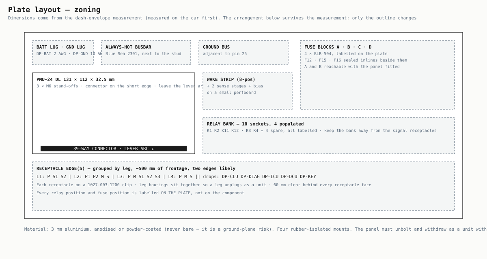

Principles: the 39-way lever needs a clear arc and must be operable at least once with the plate fitted · pin 25 to the ground bus is the shortest, heaviest wire on the plate · the busbar sits beside the stud · the relay bank is kept away from the signal receptacles · receptacles are grouped by leg so a leg unplugs as a unit · blocks A and B are reachable with the panel in place · the PMU stands off the plate for airflow. Frontage needed: about 500 mm of receptacle edge, which means two edges.


---

## 6 · The legs

A leg is a bundle that can be removed without disturbing any other leg. Every device in a leg is fed and returned entirely within it; no ground crosses a leg connector. Power and signal ride in separate housings so a 25 A motor feed never shares a bundle with a ladder wire. Leg side is always the socket housing (`06-…S`), box side always the pin housing (`04-…P`), so a leg cannot be plugged into the wrong half.

| Series | Contact | Wire | Rated | Used for |
|---|---|---|---|---|
| Deutsch DTP | size 12 | 10–14 AWG seal | 25 A | All `-P` housings |
| Deutsch DT | size 16 | 14–20 AWG seal | 13 A | All `-M` and `-S` housings, D1 / D2, DP-CLU, DP-ICU, DP-DCU |
| Deutsch DTM | size 20 | 14–22 AWG seal | 7.5 A | DP-DIAG and DP-KEY |

**Housing schedule**

| Code | Leg | Class | Leg side | Box side | Cav | Used | Wedgelocks | Where | Note |
|---|---|---|---|---|---|---|---|---|---|
| L1-P | L1 Engine | Power | DTP06-4S | DTP04-4P | 4 | 3 | WP-4S + WP-4P | Dash post | 12 AWG, size 12. Unused cavity gets a sealing plug (engine-leg rule) |
| L1-S1 | L1 Engine | Signal | DT06-12S | DT04-12P | 12 | 8 | W12S + W12P | Dash post | 16 AWG, size 16. Unused cavities get sealing plugs |
| L1-S2 | L1 Engine | Signal | DT06-12S | DT04-12P | 12 | 6 | W12S + W12P | Dash post | 16 AWG, size 16. Unused cavities get sealing plugs |
| L2-P1 | L2 Front | Power | DTP06-4S | DTP04-4P | 4 | 4 | WP-4S + WP-4P | Dash post | Headlights + pop-up LH |
| L2-P2 | L2 Front | Power | DTP06-4S | DTP04-4P | 4 | 4 | WP-4S + WP-4P | Dash post | Pop-up RH + heavy spares |
| L2-M | L2 Front | Medium | DT06-8S | DT04-8P | 8 | 8 | W8S + W8P | Dash post | 14–16 AWG |
| L2-S | L2 Front | Signal | DT06-6S | DT04-6P | 6 | 6 | W6S + W6P | Dash post | Ladders. Route apart from L2-P1 / P2 |
| L3-P | L3 Dash | Power | DTP06-2S | DTP04-2P | 2 | 2 | WP-2S + WP-2P | Dash post | Blower + comfort bus |
| L3-M | L3 Dash | Medium | DT06-2S | DT04-2P | 2 | 2 | W2S + W2P | Dash post | Head unit + USB-C |
| L3-S1 | L3 Dash | Signal | DT06-12S | DT04-12P | 12 | 12 | W12S + W12P | Dash post | Every ladder and switch input |
| L3-S2 | L3 Dash | Signal | DT06-12S | DT04-12P | 12 | 12 | W12S + W12P | Dash post | Wake sources, switch supply, courtesy, capped window commands |
| L3-S3 | L3 Dash | Signal | DT06-8S | DT04-8P | 8 | 8 | W8S + W8P | Dash post | Capped pass-through + spares |
| L4-P | L4 Rear | Power | DTP06-4S | DTP04-4P | 4 | 4 | WP-4S + WP-4P | Dash post | Defog, fuel pump, amp, capped window bus |
| L4-M | L4 Rear | Medium | DT06-12S | DT04-12P | 12 | 12 | W12S + W12P | Dash post | Rear lamps, interior lamp, capped solenoids and window commands |
| L4-S | L4 Rear | Signal | DT06-8S | DT04-8P | 8 | 8 | W8S + W8P | Dash post | Fuel sender, door ladder, courtesy, capped pass-through |
| D1 | L4 Rear (sill) | Door | DT06-08S | DT04-08P | 8 | 8 | W8S + W8P | Sill node | Driver door — no live conductor this build |
| D2 | L4 Rear (sill) | Door | DT06-08S | DT04-08P | 8 | 8 | W8S + W8P | Sill node | Passenger door — identical to D1 |
| DP-CLU | Drop | Cluster | DT06-12S | DT04-12P | 12 | 12 | W12S + W12P | Dash post | Factory instrument cluster — gauges, indicators, illumination |
| DP-DIAG | Drop | Port | DTM06-4S | DTM04-4P | 4 | 4 | WM-4S + WM-4P | Glovebox | CAN1 laptop port + 2 A constant. 120 Ω here |
| DP-ICU | Drop | Module | DT06-12S | DT04-12P | 12 | 12 | W12S + W12P | Dash post | Future cluster module — wired and capped |
| DP-DCU | Drop | Module | DT06-6S | DT04-6P | 6 | 6 | W6S + W6P | Dash post | Future climate module — wired and capped |
| DP-KEY | Drop | Port | DTM06-4S | DTM04-4P | 4 | 4 | WM-4S + WM-4P | Dash | Future control panel — wired and capped |

### L1 · ENGINE

**Boundary** the firewall grommet — comes out for engine service or a swap. **Ground** the engine block; nothing returns through the firewall. **Rule** this leg carries only what the engine on the mounts needs today: no capped stubs for future parts — unused cavities get sealing plugs. The three LS reservations are the one exception, because the swap is a known quantity. The tach wire is shielded, grounded at the plate end only, and rides in the signal housing away from the coil feed.

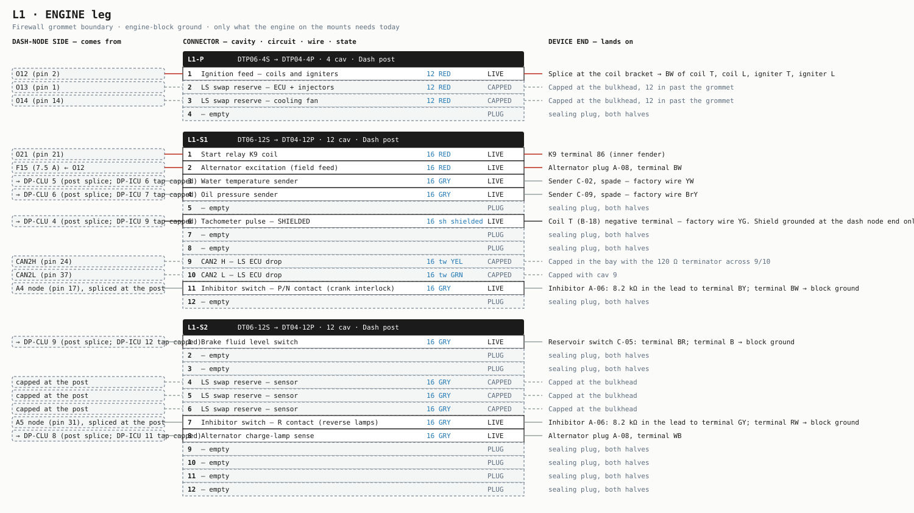


**L1-P** · DTP06-4S → DTP04-4P · 4 cavities · 12 AWG, size 12. Unused cavity gets a sealing plug (engine-leg rule)

| Cav | Circuit | From (box side) | AWG | Colour | State | Lands on (device end) |
|---|---|---|---|---|---|---|
| 1 | Ignition feed — coils and igniters | O12 (pin 2) | 12 | RED/BLU | LIVE | Splice at the coil bracket → BW of coil T, coil L, igniter T, igniter L |
| 2 | LS swap reserve — ECU + injectors | O13 (pin 1) | 12 | RED/ORN | CAPPED | Capped at the bulkhead, 12 in past the grommet |
| 3 | LS swap reserve — cooling fan | O14 (pin 14) | 12 | RED/GRY | CAPPED | Capped at the bulkhead, 12 in past the grommet |
| 4 | — empty | — | — | — | PLUG | Sealing plug, size 12 |

**L1-S1** · DT06-12S → DT04-12P · 12 cavities · 16 AWG, size 16. Unused cavities get sealing plugs

| Cav | Circuit | From (box side) | AWG | Colour | State | Lands on (device end) |
|---|---|---|---|---|---|---|
| 1 | Start relay K9 coil | O21 (pin 21) | 16 | VIO/RED | LIVE | K9 terminal 86 (inner fender) |
| 2 | Alternator excitation (field feed) | F15 (7.5 A) ← O12 | 16 | RED/BLU | LIVE | Alternator plug A-08, terminal BW |
| 3 | Water temperature sender | → DP-CLU 5 (post splice; DP-ICU 6 tap capped) | 16 | GRY/GRN | LIVE | Sender C-02, spade — factory wire YW |
| 4 | Oil pressure sender | → DP-CLU 6 (post splice; DP-ICU 7 tap capped) | 16 | GRY/BLU | LIVE | Sender C-09, spade — factory wire BrY |
| 5 | — empty | — | — | — | PLUG | Sealing plug, size 16 |
| 6 | Tachometer pulse — SHIELDED | → DP-CLU 4 (post splice; DP-ICU 9 tap capped) | 16 sh | shielded | LIVE | Coil T (B-18) negative terminal — factory wire YG. Shield grounded at the plate end only |
| 7 | — empty | — | — | — | PLUG | Sealing plug, size 16 |
| 8 | — empty | — | — | — | PLUG | Sealing plug, size 16 |
| 9 | CAN2 H — LS ECU drop | CAN2H (pin 24) | 16 tw | YEL/BLK | CAPPED | Capped in the bay with the 120 Ω terminator across 9/10 |
| 10 | CAN2 L — LS ECU drop | CAN2L (pin 37) | 16 tw | GRN/BLK | CAPPED | Capped with cav 9 |
| 11 | Inhibitor switch — P/N contact (crank interlock) | A4 node (pin 17), spliced at the post | 16 | GRY/BLK | LIVE | Inhibitor A-06: 8.2 kΩ in the lead to terminal BY; terminal BW → block ground |
| 12 | — empty | — | — | — | PLUG | Sealing plug, size 16 |

**L1-S2** · DT06-12S → DT04-12P · 12 cavities · 16 AWG, size 16. Unused cavities get sealing plugs

| Cav | Circuit | From (box side) | AWG | Colour | State | Lands on (device end) |
|---|---|---|---|---|---|---|
| 1 | Brake fluid level switch | → DP-CLU 9 (post splice; DP-ICU 12 tap capped) | 16 | GRY/PNK | LIVE | Reservoir switch C-05: terminal BR; terminal B → block ground |
| 2 | — empty | — | — | — | PLUG | Sealing plug, size 16 |
| 3 | — empty | — | — | — | PLUG | Sealing plug, size 16 |
| 4 | LS swap reserve — sensor | capped at the post | 16 | GRY | CAPPED | Capped at the bulkhead |
| 5 | LS swap reserve — sensor | capped at the post | 16 | GRY | CAPPED | Capped at the bulkhead |
| 6 | LS swap reserve — sensor | capped at the post | 16 | GRY | CAPPED | Capped at the bulkhead |
| 7 | Inhibitor switch — R contact (reverse lamps) | A5 node (pin 31), spliced at the post | 16 | GRY/BRN | LIVE | Inhibitor A-06: 8.2 kΩ in the lead to terminal GY; terminal RW → block ground |
| 8 | Alternator charge-lamp sense | → DP-CLU 8 (post splice; DP-ICU 11 tap capped) | 16 | GRY/WHT | LIVE | Alternator plug A-08, terminal WB |
| 9 | — empty | — | — | — | PLUG | Sealing plug, size 16 |
| 10 | — empty | — | — | — | PLUG | Sealing plug, size 16 |
| 11 | — empty | — | — | — | PLUG | Sealing plug, size 16 |
| 12 | — empty | — | — | — | PLUG | Sealing plug, size 16 |

### L2 · FRONT

**Boundary** firewall to radiator support, cowl included — comes out with the nose, bumper and pop-up assemblies. **Ground** the front star stud on the radiator support. Two DTP shells because DTP exists only in 2- and 4-way. Keep L2-S out of the L2-P bundle: pop-up motor feeds are the noisiest conductors in the nose and the ladders the most sensitive. Horns get a deliberate ground wire — the factory grounded them through their brackets.

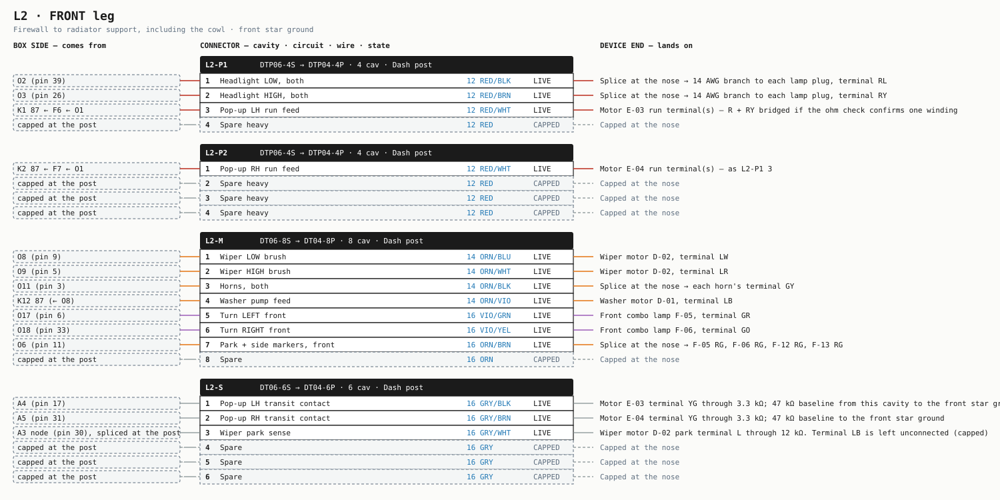


**L2-P1** · DTP06-4S → DTP04-4P · 4 cavities · Headlights + pop-up LH

| Cav | Circuit | From (box side) | AWG | Colour | State | Lands on (device end) |
|---|---|---|---|---|---|---|
| 1 | Headlight LOW, both | O2 (pin 39) | 12 | RED/BLK | LIVE | Splice at the nose → 14 AWG branch to each lamp plug, terminal RL |
| 2 | Headlight HIGH, both | O3 (pin 26) | 12 | RED/BRN | LIVE | Splice at the nose → 14 AWG branch to each lamp plug, terminal RY |
| 3 | Pop-up LH run feed | K1 87 ← F6 ← O1 | 12 | RED/WHT | LIVE | Motor E-03 run terminal(s) — R + RY bridged if the ohm check confirms one winding |
| 4 | Spare heavy | capped at the post | 12 | RED | CAPPED | Capped at the nose |

**L2-P2** · DTP06-4S → DTP04-4P · 4 cavities · Pop-up RH + heavy spares

| Cav | Circuit | From (box side) | AWG | Colour | State | Lands on (device end) |
|---|---|---|---|---|---|---|
| 1 | Pop-up RH run feed | K2 87 ← F7 ← O1 | 12 | RED/WHT | LIVE | Motor E-04 run terminal(s) — as L2-P1 3 |
| 2 | Spare heavy | capped at the post | 12 | RED | CAPPED | Capped at the nose |
| 3 | Spare heavy | capped at the post | 12 | RED | CAPPED | Capped at the nose |
| 4 | Spare heavy | capped at the post | 12 | RED | CAPPED | Capped at the nose |

**L2-M** · DT06-8S → DT04-8P · 8 cavities · 14–16 AWG

| Cav | Circuit | From (box side) | AWG | Colour | State | Lands on (device end) |
|---|---|---|---|---|---|---|
| 1 | Wiper LOW brush | O8 (pin 9) | 14 | ORN/BLU | LIVE | Wiper motor D-02, terminal LW |
| 2 | Wiper HIGH brush | O9 (pin 5) | 14 | ORN/WHT | LIVE | Wiper motor D-02, terminal LR |
| 3 | Horns, both | O11 (pin 3) | 14 | ORN/BLK | LIVE | Splice at the nose → each horn's terminal GY |
| 4 | Washer pump feed | K12 87 (← O8) | 14 | ORN/VIO | LIVE | Washer motor D-01, terminal LB |
| 5 | Turn LEFT front | O17 (pin 6) | 16 | VIO/GRN | LIVE | Front combo lamp F-05, terminal GR |
| 6 | Turn RIGHT front | O18 (pin 33) | 16 | VIO/YEL | LIVE | Front combo lamp F-06, terminal GO |
| 7 | Park + side markers, front | O6 (pin 11) | 16 | ORN/BRN | LIVE | Splice at the nose → F-05 RG, F-06 RG, F-12 RG, F-13 RG |
| 8 | Spare | capped at the post | 16 | ORN | CAPPED | Capped at the nose |

**L2-S** · DT06-6S → DT04-6P · 6 cavities · Ladders. Route apart from L2-P1 / P2

| Cav | Circuit | From (box side) | AWG | Colour | State | Lands on (device end) |
|---|---|---|---|---|---|---|
| 1 | Pop-up LH transit contact | A4 (pin 17) | 16 | GRY/BLK | LIVE | Motor E-03 terminal YG through 3.3 kΩ; 47 kΩ baseline from this cavity to the front star ground |
| 2 | Pop-up RH transit contact | A5 (pin 31) | 16 | GRY/BRN | LIVE | Motor E-04 terminal YG through 3.3 kΩ; 47 kΩ baseline to the front star ground |
| 3 | Wiper park sense | A3 node (pin 30), spliced at the post | 16 | GRY/WHT | LIVE | Wiper motor D-02 park terminal L through 12 kΩ. Terminal LB is left unconnected (capped) |
| 4 | Spare | capped at the post | 16 | GRY | CAPPED | Capped at the nose |
| 5 | Spare | capped at the post | 16 | GRY | CAPPED | Capped at the nose |
| 6 | Spare | capped at the post | 16 | GRY | CAPPED | Capped at the nose |

### L3 · DASH

**Boundary** the dash structure. **Ground** the plate's ground bus. Almost entirely signal: two heavy conductors, two medium and everything else 16 AWG, because every multi-position switch is a ladder on one wire. The plate and the five drops live here but belong to no leg.

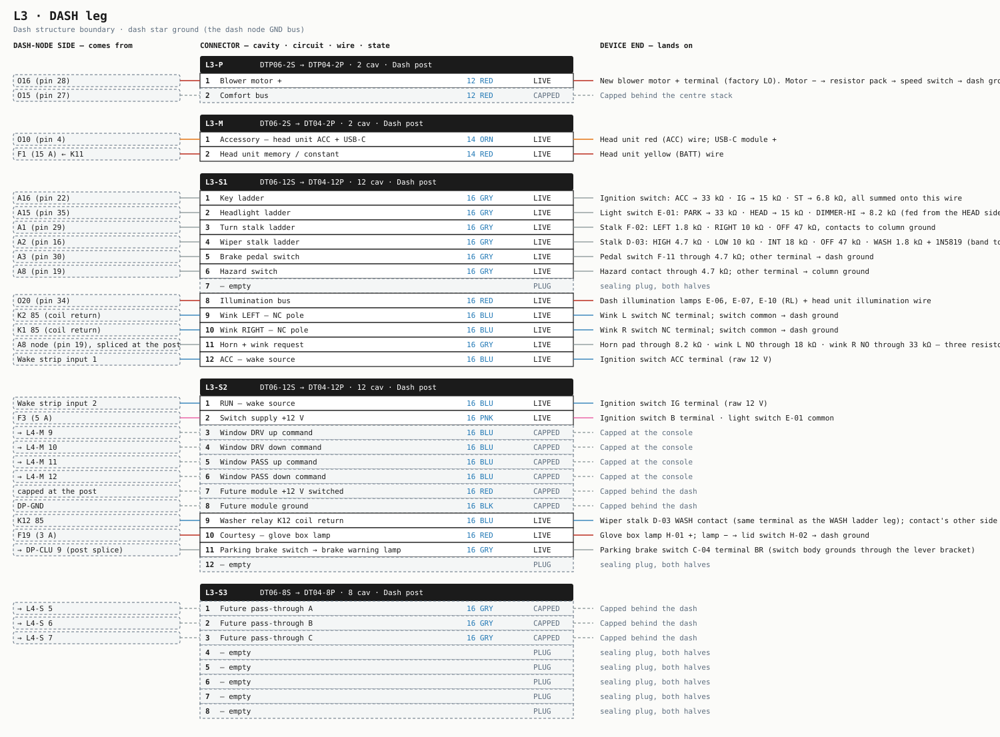


**L3-P** · DTP06-2S → DTP04-2P · 2 cavities · Blower + comfort bus

| Cav | Circuit | From (box side) | AWG | Colour | State | Lands on (device end) |
|---|---|---|---|---|---|---|
| 1 | Blower motor + | O16 (pin 28) | 12 | RED/PNK | LIVE | New blower motor + terminal (factory LO). Motor − → resistor pack → speed switch → dash ground |
| 2 | Comfort bus | O15 (pin 27), from block D input | 12 | RED/VIO | CAPPED | Capped behind the centre stack |

**L3-M** · DT06-2S → DT04-2P · 2 cavities · Head unit + USB-C

| Cav | Circuit | From (box side) | AWG | Colour | State | Lands on (device end) |
|---|---|---|---|---|---|---|
| 1 | Accessory — head unit ACC + USB-C | O10 (pin 4) | 14 | ORN/YEL | LIVE | Head unit red (ACC) wire; USB-C module + |
| 2 | Head unit memory / constant | F1 (15 A) ← K11 | 14 | RED | LIVE | Head unit yellow (BATT) wire |

**L3-S1** · DT06-12S → DT04-12P · 12 cavities · Every ladder and switch input

| Cav | Circuit | From (box side) | AWG | Colour | State | Lands on (device end) |
|---|---|---|---|---|---|---|
| 1 | Key ladder | A16 (pin 22) | 16 | GRY/RED | LIVE | Ignition switch: ACC → 33 kΩ · IG → 15 kΩ · ST → 6.8 kΩ, all summed onto this wire |
| 2 | Headlight ladder | A15 (pin 35) | 16 | GRY/WHT | LIVE | Light switch E-01: PARK → 33 kΩ · HEAD → 15 kΩ · DIMMER-HI → 8.2 kΩ (fed from the HEAD side) · PASS → 3.3 kΩ |
| 3 | Turn stalk ladder | A1 (pin 29) | 16 | GRY/GRN | LIVE | Stalk F-02: LEFT 1.8 kΩ · RIGHT 10 kΩ · OFF 47 kΩ, contacts to column ground |
| 4 | Wiper stalk ladder | A2 (pin 16) | 16 | GRY/BLU | LIVE | Stalk D-03: HIGH 4.7 kΩ · LOW 10 kΩ · INT 18 kΩ · OFF 47 kΩ · WASH 1.8 kΩ + 1N5819 (band toward the contact) |
| 5 | Brake pedal switch | A3 (pin 30) | 16 | GRY/ORN | LIVE | Pedal switch F-11 through 4.7 kΩ; other terminal → dash ground |
| 6 | Hazard switch | A8 (pin 19) | 16 | GRY/PNK | LIVE | Hazard contact through 4.7 kΩ; other terminal → column ground |
| 7 | Spare | capped at the post | 16 | GRY | CAPPED | Capped behind the dash |
| 8 | Illumination bus | O20 (pin 34) | 16 | VIO/WHT | LIVE | Dash illumination lamps E-06, E-07, E-10 (RL) + head unit illumination wire |
| 9 | Wink LEFT — NC pole | K2 85 (coil return) | 16 | BLU/GRN | LIVE | Wink L switch NC terminal; switch common → dash ground |
| 10 | Wink RIGHT — NC pole | K1 85 (coil return) | 16 | BLU/YEL | LIVE | Wink R switch NC terminal; switch common → dash ground |
| 11 | Horn + wink request | A8 node (pin 19), spliced at the post | 16 | GRY/BLK | LIVE | Horn pad through 8.2 kΩ · wink L NO through 18 kΩ · wink R NO through 33 kΩ — three resistors joined onto this wire |
| 12 | ACC — wake source | Wake strip input 1 | 16 | BLU/WHT | LIVE | Ignition switch ACC terminal (raw 12 V) |

**L3-S2** · DT06-12S → DT04-12P · 12 cavities · Wake sources, switch supply, courtesy, capped window commands

| Cav | Circuit | From (box side) | AWG | Colour | State | Lands on (device end) |
|---|---|---|---|---|---|---|
| 1 | RUN — wake source | Wake strip input 2 | 16 | BLU | LIVE | Ignition switch IG terminal (raw 12 V) |
| 2 | Switch supply +12 V | F3 (5 A) | 16 | PNK | LIVE | Ignition switch B terminal · light switch E-01 common |
| 3 | Window DRV up command | → L4-M 9 | 16 | BLU/BRN | CAPPED | Capped at the console |
| 4 | Window DRV down command | → L4-M 10 | 16 | BLU/BLK | CAPPED | Capped at the console |
| 5 | Window PASS up command | → L4-M 11 | 16 | BLU/VIO | CAPPED | Capped at the console |
| 6 | Window PASS down command | → L4-M 12 | 16 | BLU/ORN | CAPPED | Capped at the console |
| 7 | Future module +12 V switched | capped at the post | 16 | ORN/GRY | CAPPED | Capped behind the dash |
| 8 | Future module ground | DP-GND | 16 | BLK | CAPPED | Capped behind the dash |
| 9 | Washer relay K12 coil return | K12 85 | 16 | BLU/GRY | LIVE | Wiper stalk D-03 WASH contact (same terminal as the WASH ladder leg); contact's other side → column ground |
| 10 | Courtesy — glove box lamp | F19 (3 A) | 16 | RED | LIVE | Glove box lamp H-01 +; lamp − → lid switch H-02 → dash ground |
| 11 | Parking brake switch → brake warning lamp | → DP-CLU 9 (post splice) | 16 | GRY/PNK | LIVE | Parking brake switch C-04 terminal BR (switch body grounds through the lever bracket) |
| 12 | Spare | capped at the post | 16 | GRY | CAPPED | Capped behind the dash |

**L3-S3** · DT06-8S → DT04-8P · 8 cavities · Capped pass-through + spares

| Cav | Circuit | From (box side) | AWG | Colour | State | Lands on (device end) |
|---|---|---|---|---|---|---|
| 1 | Future pass-through A | → L4-S 5 | 16 | GRY/BRN | CAPPED | Capped behind the dash |
| 2 | Future pass-through B | → L4-S 6 | 16 | GRY/BLU | CAPPED | Capped behind the dash |
| 3 | Future pass-through C | → L4-S 7 | 16 | GRY/ORN | CAPPED | Capped behind the dash |
| 4 | Spare | capped at the post | 16 | GRY | CAPPED | Capped behind the dash |
| 5 | Spare | capped at the post | 16 | GRY | CAPPED | Capped behind the dash |
| 6 | Spare | capped at the post | 16 | GRY | CAPPED | Capped behind the dash |
| 7 | Spare | capped at the post | 16 | GRY | CAPPED | Capped behind the dash |
| 8 | Spare | capped at the post | 16 | GRY | CAPPED | Capped behind the dash |

### L4 · REAR

**Boundary** the tunnel entry at the console, back to the hatch, plus the sill runs into both doors. **Ground** the rear star stud in the cargo bin; the doors ground at the sill stud, never inside a door. The tunnel run is the longest in the car — voltage drop, not current, sets the 12 AWG on the defog and pump feeds. The fuel sender wire is routed apart from the fuel pump feed.

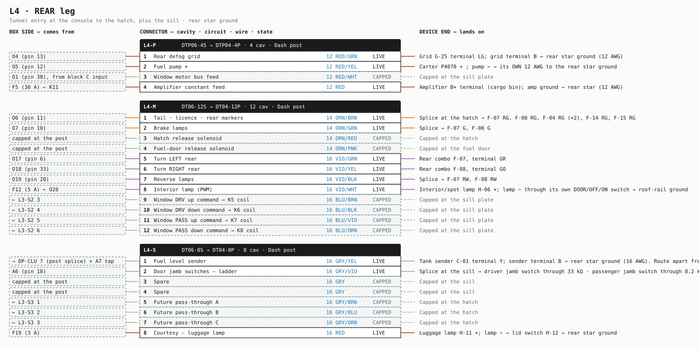


**L4-P** · DTP06-4S → DTP04-4P · 4 cavities · Defog, fuel pump, amp, capped window bus

| Cav | Circuit | From (box side) | AWG | Colour | State | Lands on (device end) |
|---|---|---|---|---|---|---|
| 1 | Rear defog grid | O4 (pin 13) | 12 | RED/GRN | LIVE | Grid G-25 terminal LG; grid terminal B → rear star ground (12 AWG) |
| 2 | Fuel pump + | O5 (pin 12) | 12 | RED/YEL | LIVE | Carter P4070 + ; pump − → its OWN 12 AWG to the rear star ground |
| 3 | Window motor bus feed | O1 (pin 38), from block C input | 12 | RED/WHT | CAPPED | Capped at the sill plate |
| 4 | Amplifier constant feed | F5 (30 A) ← K11 | 12 | RED | LIVE | Amplifier B+ terminal (cargo bin); amp ground → rear star (12 AWG) |

**L4-M** · DT06-12S → DT04-12P · 12 cavities · Rear lamps, interior lamp, capped solenoids and window commands

| Cav | Circuit | From (box side) | AWG | Colour | State | Lands on (device end) |
|---|---|---|---|---|---|---|
| 1 | Tail · licence · rear markers | O6 (pin 11) | 14 | ORN/BRN | LIVE | Splice at the hatch → F-07 RG, F-08 RG, F-04 RG (×2), F-14 RG, F-15 RG |
| 2 | Brake lamps | O7 (pin 10) | 14 | ORN/GRN | LIVE | Splice → F-07 G, F-08 G |
| 3 | Hatch release solenoid | capped at the post | 14 | ORN/RED | CAPPED | Capped at the hatch |
| 4 | Fuel-door release solenoid | capped at the post | 14 | ORN/PNK | CAPPED | Capped at the fuel door |
| 5 | Turn LEFT rear | O17 (pin 6) | 16 | VIO/GRN | LIVE | Rear combo F-07, terminal GR |
| 6 | Turn RIGHT rear | O18 (pin 33) | 16 | VIO/YEL | LIVE | Rear combo F-08, terminal GO |
| 7 | Reverse lamps | O19 (pin 20) | 16 | VIO/BLK | LIVE | Splice → F-07 RW, F-08 RW |
| 8 | Interior lamp (PWM) | F12 (5 A) ← O20 | 16 | VIO/WHT | LIVE | Interior/spot lamp H-06 +; lamp − through its own DOOR/OFF/ON switch → roof-rail ground |
| 9 | Window DRV up command → K5 coil | ← L3-S2 3 | 16 | BLU/BRN | CAPPED | Capped at the sill plate |
| 10 | Window DRV down command → K6 coil | ← L3-S2 4 | 16 | BLU/BLK | CAPPED | Capped at the sill plate |
| 11 | Window PASS up command → K7 coil | ← L3-S2 5 | 16 | BLU/VIO | CAPPED | Capped at the sill plate |
| 12 | Window PASS down command → K8 coil | ← L3-S2 6 | 16 | BLU/ORN | CAPPED | Capped at the sill plate |

**L4-S** · DT06-8S → DT04-8P · 8 cavities · Fuel sender, door ladder, courtesy, capped pass-through

| Cav | Circuit | From (box side) | AWG | Colour | State | Lands on (device end) |
|---|---|---|---|---|---|---|
| 1 | Fuel level sender | → DP-CLU 7 (post splice) + A7 tap | 16 | GRY/YEL | LIVE | Tank sender C-01 terminal Y; sender terminal B → rear star ground (16 AWG). Route apart from L4-P |
| 2 | Door jamb switches — ladder | A6 (pin 18) | 16 | GRY/VIO | LIVE | Splice at the sill → driver jamb switch through 33 kΩ · passenger jamb switch through 8.2 kΩ; each switch grounds through its body |
| 3 | Spare | capped at the post | 16 | GRY | CAPPED | Capped at the sill |
| 4 | Spare | capped at the post | 16 | GRY | CAPPED | Capped at the sill |
| 5 | Future pass-through A | ← L3-S3 1 | 16 | GRY/BRN | CAPPED | Capped at the hatch |
| 6 | Future pass-through B | ← L3-S3 2 | 16 | GRY/BLU | CAPPED | Capped at the hatch |
| 7 | Future pass-through C | ← L3-S3 3 | 16 | GRY/ORN | CAPPED | Capped at the hatch |
| 8 | Courtesy — luggage lamp | F19 (3 A) | 16 | RED | LIVE | Luggage lamp H-11 +; lamp − → lid switch H-12 → rear star ground |

### Sill node and the door connectors

A small plate behind the driver's kick panel: the D1 / D2 receptacles, a ground stud to the chassis, four empty relay sockets and three empty sealed fuse holders. It is a sub-assembly of the rear leg, not a fifth leg. **No conductor on it is live in this build** — every door wire is run through the door boot and capped inside the door so a future door project never touches the harness. The door jamb switches are body-mounted plungers wired at the sill, not through the door connectors.

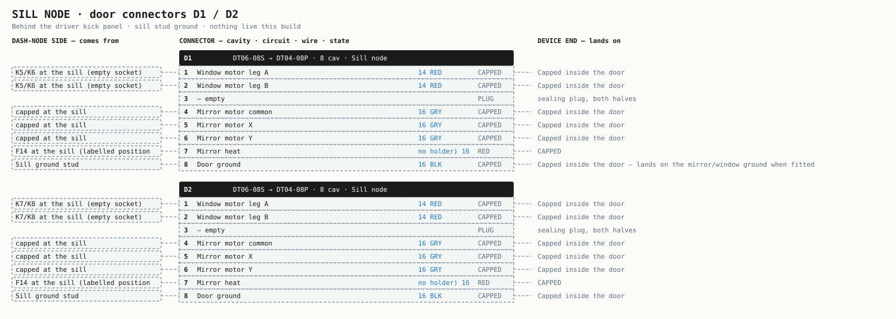


**D1**

| Cav | Circuit | From | AWG | Colour | State | Lands on |
|---|---|---|---|---|---|---|
| 1 | Window motor leg A | K5/K6 at the sill (empty socket) | 14 | RED/WHT | CAPPED | Capped inside the door |
| 2 | Window motor leg B | K5/K6 at the sill (empty socket) | 14 | RED/WHT | CAPPED | Capped inside the door |
| 3 | Spare | capped at the sill | 16 | GRY | CAPPED | Capped inside the door |
| 4 | Mirror motor common | capped at the sill | 16 | GRY/GRN | CAPPED | Capped inside the door |
| 5 | Mirror motor X | capped at the sill | 16 | GRY/BLU | CAPPED | Capped inside the door |
| 6 | Mirror motor Y | capped at the sill | 16 | GRY/ORN | CAPPED | Capped inside the door |
| 7 | Mirror heat | F14 at the sill (empty holder) | 16 | RED/VIO | CAPPED | Capped inside the door |
| 8 | Door ground | Sill ground stud | 16 | BLK | CAPPED | Capped inside the door — lands on the mirror/window ground when fitted |

**D2**

| Cav | Circuit | From | AWG | Colour | State | Lands on |
|---|---|---|---|---|---|---|
| 1 | Window motor leg A | K7/K8 at the sill (empty socket) | 14 | RED/WHT | CAPPED | Capped inside the door |
| 2 | Window motor leg B | K7/K8 at the sill (empty socket) | 14 | RED/WHT | CAPPED | Capped inside the door |
| 3 | Spare | capped at the sill | 16 | GRY | CAPPED | Capped inside the door |
| 4 | Mirror motor common | capped at the sill | 16 | GRY/GRN | CAPPED | Capped inside the door |
| 5 | Mirror motor X | capped at the sill | 16 | GRY/BLU | CAPPED | Capped inside the door |
| 6 | Mirror motor Y | capped at the sill | 16 | GRY/ORN | CAPPED | Capped inside the door |
| 7 | Mirror heat | F14 at the sill (empty holder) | 16 | RED/VIO | CAPPED | Capped inside the door |
| 8 | Door ground | Sill ground stud | 16 | BLK | CAPPED | Capped inside the door |

---

## 7 · Dash-post drops

Five connectors on the plate edge for devices that sit inches from it and belong to no leg. Their grounds are the only grounds in the car that cross a connector.

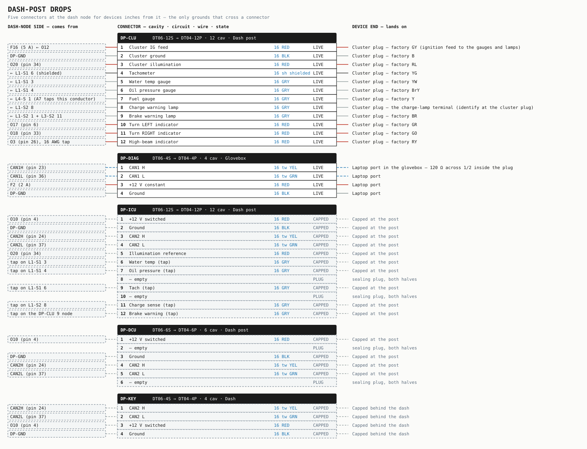


### 7.1 · DP-CLU — the factory cluster

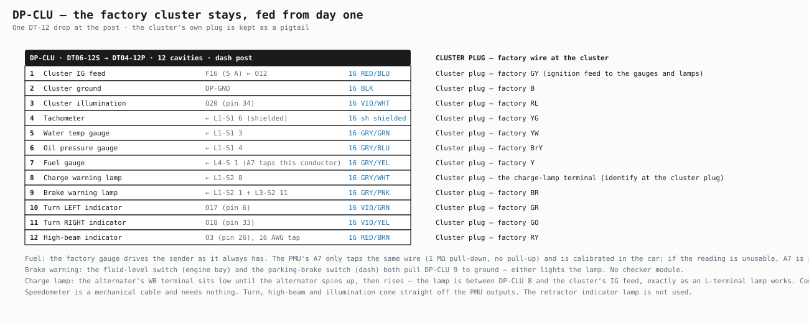

The car keeps its instruments. One DT-12 drop feeds the cluster's ignition supply (F16), ground, illumination (the O20 PWM bus, so the cluster dims with the rest of the dash), the tachometer pulse from the trailing coil, the water-temperature and oil-pressure senders, the fuel sender, the alternator's lamp terminal, the brake-warning switches and the three indicators. The factory cluster plug is kept as a pigtail and re-terminated, so no cluster pin has to be sourced. The retractor indicator lamp is not used (its YG line is now a ladder input).

| Cav | Circuit | From | AWG | Colour | State | Cluster plug |
|---|---|---|---|---|---|---|
| 1 | Cluster IG feed | F16 (5 A) ← O12 | 16 | RED/BLU | LIVE | Cluster plug — factory GY (ignition feed to the gauges and lamps) |
| 2 | Cluster ground | DP-GND | 16 | BLK | LIVE | Cluster plug — factory B |
| 3 | Cluster illumination | O20 (pin 34) | 16 | VIO/WHT | LIVE | Cluster plug — factory RL |
| 4 | Tachometer | ← L1-S1 6 (shielded) | 16 sh | shielded | LIVE | Cluster plug — factory YG |
| 5 | Water temp gauge | ← L1-S1 3 | 16 | GRY/GRN | LIVE | Cluster plug — factory YW |
| 6 | Oil pressure gauge | ← L1-S1 4 | 16 | GRY/BLU | LIVE | Cluster plug — factory BrY |
| 7 | Fuel gauge | ← L4-S 1 (A7 taps this conductor) | 16 | GRY/YEL | LIVE | Cluster plug — factory Y |
| 8 | Charge warning lamp | ← L1-S2 8 | 16 | GRY/WHT | LIVE | Cluster plug — the charge-lamp terminal (identify at the cluster plug) |
| 9 | Brake warning lamp | ← L1-S2 1 + L3-S2 11 | 16 | GRY/PNK | LIVE | Cluster plug — factory BR |
| 10 | Turn LEFT indicator | O17 (pin 6) | 16 | VIO/GRN | LIVE | Cluster plug — factory GR |
| 11 | Turn RIGHT indicator | O18 (pin 33) | 16 | VIO/YEL | LIVE | Cluster plug — factory GO |
| 12 | High-beam indicator | O3 (pin 26), 16 AWG tap | 16 | RED/BRN | LIVE | Cluster plug — factory RY |

### DP-DIAG
The laptop port, in the glovebox. CAN1 (with its 120 Ω inside the plug), a 2 A constant and ground. The PMU is configured through this port with the module in the car.

| Cav | Circuit | From | AWG | Colour | State | Lands on |
|---|---|---|---|---|---|---|
| 1 | CAN1 H | CAN1H (pin 23) | 16 tw | YEL | LIVE | Laptop port in the glovebox — 120 Ω across 1/2 inside the plug |
| 2 | CAN1 L | CAN1L (pin 36) | 16 tw | GRN | LIVE | Laptop port |
| 3 | +12 V constant | F2 (2 A) | 16 | RED | LIVE | Laptop port |
| 4 | Ground | DP-GND | 16 | BLK | LIVE | Laptop port |

### DP-ICU
Future digital-cluster module. Power, ground, CAN2, illumination reference, and taps on the sensor conductors — all capped at the post.

| Cav | Circuit | From | AWG | Colour | State | Lands on |
|---|---|---|---|---|---|---|
| 1 | +12 V switched | O10 (pin 4) | 16 | ORN/YEL | CAPPED | Capped at the post |
| 2 | Ground | DP-GND | 16 | BLK | CAPPED | Capped at the post |
| 3 | CAN2 H | CAN2H (pin 24) | 16 tw | YEL/BLK | CAPPED | Capped at the post |
| 4 | CAN2 L | CAN2L (pin 37) | 16 tw | GRN/BLK | CAPPED | Capped at the post |
| 5 | Illumination reference | O20 (pin 34) | 16 | VIO/WHT | CAPPED | Capped at the post |
| 6 | Water temp (tap) | tap on L1-S1 3 | 16 | GRY/GRN | CAPPED | Capped at the post |
| 7 | Oil pressure (tap) | tap on L1-S1 4 | 16 | GRY/BLU | CAPPED | Capped at the post |
| 8 | Spare | capped | 16 | GRY | CAPPED | Capped at the post |
| 9 | Tach (tap) | tap on L1-S1 6 | 16 | GRY/YEL | CAPPED | Capped at the post |
| 10 | Spare | capped | 16 | GRY | CAPPED | Capped at the post |
| 11 | Charge sense (tap) | tap on L1-S2 8 | 16 | GRY/WHT | CAPPED | Capped at the post |
| 12 | Brake warning (tap) | tap on the DP-CLU 9 node | 16 | GRY/PNK | CAPPED | Capped at the post |

### DP-DCU
Future climate module. Power, ground, CAN2 — capped at the post.

| Cav | Circuit | From | AWG | Colour | State | Lands on |
|---|---|---|---|---|---|---|
| 1 | +12 V switched | O10 (pin 4) | 16 | ORN/YEL | CAPPED | Capped at the post |
| 2 | Spare | capped | 16 | GRY | CAPPED | Capped at the post |
| 3 | Ground | DP-GND | 16 | BLK | CAPPED | Capped at the post |
| 4 | CAN2 H | CAN2H (pin 24) | 16 tw | YEL/BLK | CAPPED | Capped at the post |
| 5 | CAN2 L | CAN2L (pin 37) | 16 tw | GRN/BLK | CAPPED | Capped at the post |
| 6 | Spare | capped | 16 | GRY | CAPPED | Capped at the post |

### DP-KEY
Future control panel. CAN2, switched 12 V, ground — capped behind the dash.

| Cav | Circuit | From | AWG | Colour | State | Lands on |
|---|---|---|---|---|---|---|
| 1 | CAN2 H | CAN2H (pin 24) | 16 tw | YEL/BLK | CAPPED | Capped behind the dash |
| 2 | CAN2 L | CAN2L (pin 37) | 16 tw | GRN/BLK | CAPPED | Capped behind the dash |
| 3 | +12 V switched | O10 (pin 4) | 16 | ORN/YEL | CAPPED | Capped behind the dash |
| 4 | Ground | DP-GND | 16 | BLK | CAPPED | Capped behind the dash |

---

## 8 · Switches and how they are read

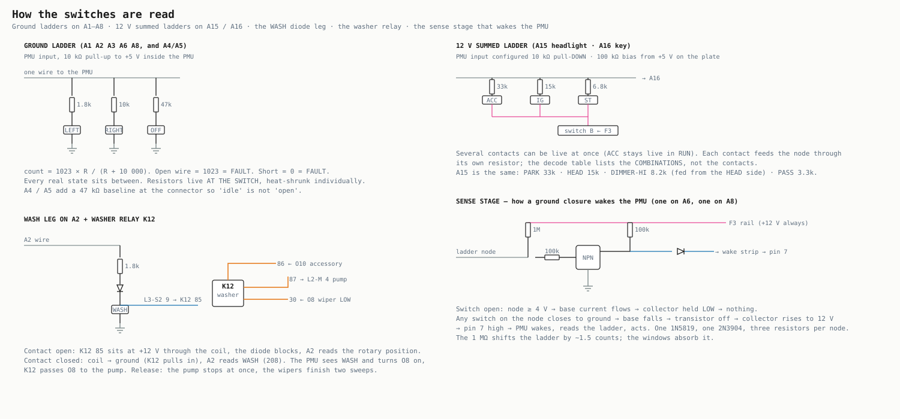

**The column combination switch stays** (light / dimmer / passing, turn / hazard, wiper / washer) — it is mechanically sound. **Every other switch is new:** ignition switch (electrical portion), brake pedal switch, blower speed switch, two wink pushbuttons, four plunger switches (door jambs, glove box, luggage lid). The horn stays on the steering pad.

**No state uses a dead short.** Every switch position reaches ground through a resistor, so an open wire reads full scale and a chafed wire reads zero — both are faults, never a position. Resistors are 1 % metal film, 1/4 W, fitted at the switch and heat-shrunk individually; one wire returns to the plate per ladder. Decode as windows: a reading between windows is a fault, not the nearest state.


### 8.1 · Ground ladders — A1 to A8 (10-bit, internal 10 kΩ pull-up to 5 V)

`count = 1023 × R / (R + 10 000)` — with a diode in the leg, `V = 0.3 + 4.7 × R / (R + 10 000)`.


**A1 · Turn stalk** — window ± 55 counts · < 50 = short · > 990 = open

| State | Resistance to ground | ADC |
|---|---|---|
| LEFT | 1.8k | 156 |
| RIGHT | 10k | 512 |
| OFF | 47k | 844 |

**A2 · Wiper stalk** — window ± 45 counts · < 50 = short · > 990 = open

| State | Resistance to ground | ADC |
|---|---|---|
| WASH | 1.8k + 1N5819 | 208 |
| HIGH | 4.7k | 327 |
| LOW | 10k | 512 |
| INT | 18k | 658 |
| OFF | 47k | 844 |

**A3 · Brake pedal + wiper park** — window ± 30 counts · < 50 = short · > 990 = open

| State | Resistance to ground | ADC |
|---|---|---|
| BRAKE+PARKED | 4.7k ∥ 12k | 258 |
| BRAKE | 4.7k | 327 |
| PARKED | 12k | 558 |

**A4 · Pop-up L transit + inhibitor P/N** — window ± 20 counts · < 50 = short · > 990 = open

| State | Resistance to ground | ADC |
|---|---|---|
| TRANSIT+PN | 3.3k ∥ 8.2k ∥ 47k | 187 |
| TRANSIT | 3.3k ∥ 47k | 241 |
| CRANK_OK | 8.2k ∥ 47k | 421 |
| IDLE | 47k | 844 |

**A5 · Pop-up R transit + inhibitor R** — window ± 20 counts · < 50 = short · > 990 = open

| State | Resistance to ground | ADC |
|---|---|---|
| TRANSIT+R | 3.3k ∥ 8.2k ∥ 47k | 187 |
| TRANSIT | 3.3k ∥ 47k | 241 |
| REVERSE | 8.2k ∥ 47k | 421 |
| IDLE | 47k | 844 |

**A6 · Door jamb switches** — window ± 27 counts · < 50 = short · > 990 = open

| State | Resistance to ground | ADC |
|---|---|---|
| BOTH | 33k ∥ 8.2k | 406 |
| PASS | 8.2k | 461 |
| DRV | 33k | 785 |

**A8 · Hazard · horn · wink** — window ± 35 counts · < 50 = short · > 990 = open

| State | Resistance to ground | ADC |
|---|---|---|
| HAZ+HORN | 4.7k ∥ 8.2k | 235 |
| HAZARD | 4.7k | 327 |
| HORN | 8.2k | 461 |
| WINK_L | 18k | 658 |
| WINK_R | 33k | 785 |

A7 (fuel) is not a ladder: the factory gauge drives the sender and the PMU taps the node with a 1 MΩ pull-down and no pull-up. Its three-point lookup (FULL / MID / EMPTY) is read in the car at commissioning. A8's HAZARD state is decoded as a band, 265–370, so a wink pressed while the hazards are on reads as HAZARD and does nothing.


### 8.2 · 12 V summed ladders — A15 and A16 (12-bit, 10 kΩ pull-down, 100 kΩ bias from +5 V)

Several contacts can be live at once (ACC stays live in RUN; HEAD keeps PARK live). Each contact feeds the node through its own resistor from the F3 switch supply; the table lists the combinations. The bias makes OFF read ~93 and a disconnected wire read 0.


**A15 · Headlight switch** — window ± 75 counts · 0 = disconnected

| State | Live contacts (series R from +12 V) | Node V | ADC |
|---|---|---|---|
| OFF | bias only | 0.45 | 93 |
| PARK | 33k | 2.95 | 604 |
| HEAD_LO | 33k + 15k | 5.86 | 1201 |
| HEAD_HI | 33k + 15k + 8.2k | 8.14 | 1666 |
| PASS | 33k + 15k + 8.2k + 3.3k | 9.99 | 2046 |

**A16 · Key position** — window ± 200 counts · 0 = disconnected

| State | Live contacts (series R from +12 V) | Node V | ADC |
|---|---|---|---|
| OFF | bias only | 0.45 | 93 |
| ACC | 33k | 2.95 | 604 |
| RUN | 33k + 15k | 5.86 | 1201 |
| START | 33k + 15k + 6.8k | 8.41 | 1723 |

A15 PASS is a superstate: any reading above 1750 means flash-to-pass, whatever the switch position underneath.


---

## 9 · Control logic

Written the way it is typed into the PMU client. Channel names match §4.1.

| Channel | Expression | Inrush window | Retry |
|---|---|---|---|
| HEAD_LOW | A15 == HEAD_LO | 3× for 200 ms | 3 retries, 5 s |
| HEAD_HIGH | A15 == HEAD_HI  \|\|  A15 == PASS | 3× for 200 ms | 3 retries, 5 s |
| TAIL_PARK | A15 >= PARK  (hold the previous state while PASS is active) | 10× for 100 ms | 3 retries, 5 s |
| BRAKE | A3 == BRAKE  \|\|  A3 == BRAKE+PARKED | 10× for 100 ms | 3 retries, 5 s |
| TURN_L | (A1 == LEFT  \|\|  hazard)  &&  flasher_phase | 10× for 100 ms | 3 retries, 5 s |
| TURN_R | (A1 == RIGHT  \|\|  hazard)  &&  flasher_phase | 10× for 100 ms | 3 retries, 5 s |
| REVERSE | A5 == REVERSE  &&  A16 >= RUN | 10× for 100 ms | 3 retries, 5 s |
| INTERIOR | A6 != CLOSED  — PWM, 1.5 s fade-in, 8 s fade-out after the last door closes | 10× for 100 ms | 3 retries, 5 s |
| MOTOR_BUS | popup_cycle  (see the pop-up rule below) | 7× for 400 ms | 1 retry |
| WIPE_LOW | A2 == LOW  \|\|  A2 == WASH  \|\|  (A2 == INT && int_timer)  \|\|  (wiper_latch && A3 not PARKED)  — braking ON | 7× for 300 ms | 3 retries, 5 s |
| WIPE_HIGH | A2 == HIGH | 7× for 300 ms | 3 retries, 5 s |
| BLOWER | A16 >= RUN  — speed is selected by the switch on the motor's ground side | 8× for 600 ms | 3 retries, 5 s |
| DEFOG | (no trigger this build — channel configured, output DISABLED) | 1.3× for 2 s | — |
| FUEL_PUMP | A16 >= RUN | 3× for 150 ms | 3 retries, 5 s |
| IGNITION | A16 >= RUN | 2× for 100 ms | 3 retries, 5 s |
| ACCESSORY | A16 >= ACC | 2× for 100 ms | 3 retries, 5 s |
| HORN | A8 == HORN  \|\|  A8 == HAZ+HORN | 3× for 80 ms | 3 retries, 5 s |
| COMFORT | A16 >= RUN  (nothing connected this build) | 2× for 200 ms | 3 retries, 5 s |
| START_RLY | A16 == START  &&  A4 == CRANK_OK | 2× for 50 ms | — |
| KEEP_ALIVE | self-hold: ON at any wake; OFF 30 s after the last input change with A16 == OFF and A6 == CLOSED | — | — |
| LS_ECU · LS_FAN | DISABLED | — | — |

### Rules

| Rule | Definition |
|---|---|
| Flasher | 1.5 Hz, 50 % duty, generated in the PMU. `hazard` = A8 == HAZARD \|\| A8 == HAZ+HORN. Hazard overrides the stalk and works with the key out |
| Pop-up cycle | A15 entering HEAD, or leaving HEAD, or A8 == WINK_L / WINK_R with A16 <= ACC → energise O1 until BOTH A4 and A5 leave TRANSIT (minimum 300 ms). 4 s with either still in TRANSIT = obstruction: O1 off, fault flag. A held wink switch opens the OTHER side's relay coil return, so only the winked lamp moves |
| Wiper park | When the stalk goes to OFF with the wipers running, hold O8 until A3 reads PARKED (or BRAKE+PARKED), then release — braking stops the arm at park. Intermittent: 3 s pause between full sweeps, each sweep runs until PARKED |
| Washer | WASH also holds O8 on; K12 closes only while the stalk contact is pressed, so the pump runs only while the driver holds WASH. After release, keep O8 on for two more sweeps |
| Crank | O21 only in P or N (A4 == CRANK_OK). Release O21 when A16 leaves START |
| Motor bus | Refuse a new pop-up command while O1 reads above 20 A |
| Voltage | Warn below 12.0 V. Shed COMFORT below 11.5 V. Warn above 15.0 V |
| Sleep | Any wake-strip input high wakes the PMU. With no key, no door and nothing on A8, KEEP_ALIVE drops 30 s after the last change and the PMU sleeps; K11 opens with it (audio memory relies on the head unit's own non-volatile memory) |

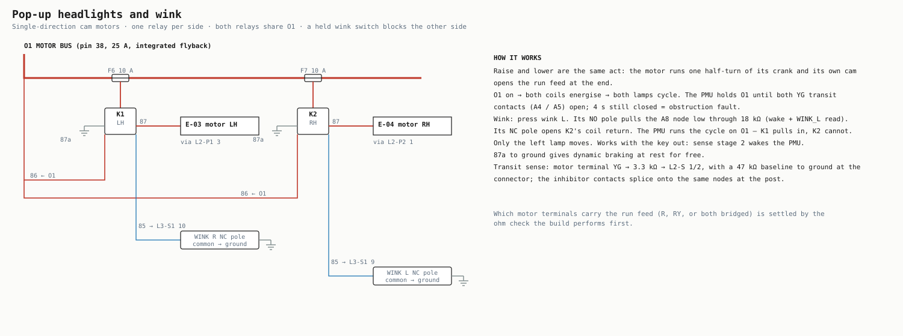


### CAN

**CAN1** — laptop only, 1 Mbps fixed, no internal termination: 120 Ω at the PMU pins and 120 Ω in the DP-DIAG plug, or the client will never see the device. **CAN2** — vehicle bus, 500 kbps, software termination ON at the PMU; the far-end 120 Ω sits capped at the engine-bay drop (L1-S1 9/10). Nothing else is on CAN2 in this build; the three dash drops are capped.


---

## 10 · Grounds

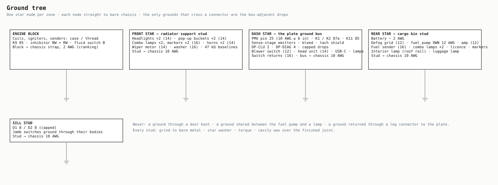

One star node per zone, each straight to bare chassis: the engine block (with its own 2 AWG strap to the body), a stud on the radiator support, the plate's ground bus, a stud in the cargo bin (where the battery negative lands), and a stud at the sill. Every device returns to its zone's node on its own wire, sized to its feed. The fuel pump has a dedicated return — it must never share a ground with a lamp. Pin 25 carries the flyback return for every inductive load on the PMU and is the shortest, heaviest wire on the plate.

| Zone | Return | AWG | Qty | ft each |
|---|---|---|---|---|
| L1 | Engine block → chassis strap | 2 | 1 | 2 |
| L1 | K9 85 → block | 16 | 1 | 3 |
| L1 | Inhibitor BW and RW → block | 16 | 2 | 3 |
| L1 | Brake fluid switch B → block | 16 | 1 | 3 |
| L2 | Front star stud → chassis | 10 | 1 | 2 |
| L2 | Headlight B → front star, each | 14 | 2 | 4 |
| L2 | Pop-up bucket strap → front star, each | 14 | 2 | 4 |
| L2 | Front combo lamp B → front star, each | 16 | 2 | 4 |
| L2 | Side marker B → front star, each | 16 | 2 | 4 |
| L2 | Horn case → front star, each | 14 | 2 | 3 |
| L2 | Wiper motor B → front star | 14 | 1 | 3 |
| L2 | Washer pump LY → front star | 16 | 1 | 3 |
| L2 | Pop-up 47 kΩ baselines → front star | 16 | 2 | 1 |
| L3 | GND bus → dash chassis star | 10 | 1 | 2 |
| L3 | Blower switch common → dash ground | 12 | 1 | 4 |
| L3 | Head unit black → dash ground | 14 | 1 | 3 |
| L3 | USB-C module − → dash ground | 16 | 1 | 3 |
| L3 | Dash illumination lamps B → dash ground | 16 | 3 | 3 |
| L3 | Glove box lamp switch → dash ground | 16 | 1 | 3 |
| L3 | Wink switch commons → dash ground | 16 | 2 | 3 |
| L3 | Brake pedal switch → dash ground | 16 | 1 | 3 |
| L3 | Turn / hazard / wiper stalk returns → column ground | 16 | 3 | 2 |
| L4 | Rear star stud → chassis | 10 | 1 | 2 |
| L4 | Battery − → rear star stud | 2 | 1 | 3 |
| L4 | Defog grid B → rear star | 12 | 1 | 6 |
| L4 | Fuel pump − → rear star (dedicated) | 12 | 1 | 4 |
| L4 | Amplifier GND → rear star | 12 | 1 | 3 |
| L4 | Fuel sender B → rear star | 16 | 1 | 5 |
| L4 | Rear combo lamp B → rear star, each | 16 | 2 | 5 |
| L4 | Licence + rear marker B → rear star | 16 | 4 | 4 |
| L4 | Interior lamp switch → roof-rail ground | 16 | 1 | 4 |
| L4 | Luggage lamp switch → rear star | 16 | 1 | 3 |
| Sill | Sill stud → chassis | 10 | 1 | 2 |

---

## 11 · Loads and wire sizing

Wire gauge is set by voltage drop over the run and by crimp robustness, not by ampacity — every conductor is good for far more than its channel. Motors are sized for stall (roughly seven times running), lamps for cold inrush (handled by the inrush window, not the limit), the defog grid for cold (it draws most in the first thirty seconds).

| Circuit | Ch | Rated | Design A | Measured A | Basis |
|---|---|---|---|---|---|
| Headlight LOW / HIGH | O2 / O3 | 25 A | 3.0 / 3.5 | — | published, two 55 W lamps |
| Tail · park · markers · licence | O6 | 15 A | 4.4 | **5.4** | factory wattage 8 W ×4 + 3.8 W ×4 + 6 W ×2 |
| Brake lamps | O7 | 15 A | 3.9 | **7.0** | 27 W ×2 — measured nearly double the estimate |
| Turn, per side | O17 / O18 | 7 A | 4.2 | **3.4** | 27 W ×2 + indicator |
| Reverse | O19 | 7 A | 3.9 | — | 27 W ×2 |
| Interior + illumination | O20 | 7 A | 2.5 | — | 5 W + 3.4 W ×5 + 1.4 W ×2 |
| Wiper LOW / HIGH | O8 / O9 | 15 A | 4 / 5.5 running · 12–20 stall | — | factory 10 A fuse; aged motor |
| Pop-up motors, both | O1 | 25 A | 8–12 running · 26 stall | **12.8 / 13.1 stall** | measured stall per side |
| Blower (new motor) | O16 | 25 A | 12–18 on HI | — | factory 20 A fuse |
| Rear defog grid | O4 | 25 A | 10–13 cold | — | factory 15 A fuse |
| Fuel pump | O5 | 25 A | 2 | **2.38** | measured; the channel is sized for a future in-tank pump |
| Ignition coils + igniters | O12 | 25 A | 4–6, rising with rpm | 1.8 idle · 2.4 at 3000 (one branch) | twin coil rotary |
| Horns, pair | O11 | 15 A | 4–8 | — | factory 15 A shared fuse |
| Washer pump | K12 ← O8 | — | 3–5 | — | class figure |
| Accessory bus — head unit, USB-C, K12 coil | O10 | 15 A | ~10 worst case | — | both USB ports loaded |
| Amplifier | F5 ← K11 | 30 A | per the amplifier | — | not a PMU load |
| Sleeping draw | — | — | PMU 150 mA, nothing else | 0 on the factory harness | K11 opens when the PMU sleeps |

---

## 12 · Device terminations

The far end of every conductor. Factory two-letter colours name the terminal on the device or its plug; the factory plug is kept as a pigtail wherever one exists.

| Zone | Device | Terminal → lands on | Ground |
|---|---|---|---|
| L1 | **Coils + igniters** — Ignition coil T (B-18), coil L (B-19), igniter T (B-20), igniter L (B-21) | BW on all four → L1-P 1 splice (12 AWG trunk, 14 AWG branches)<br>Coil T negative (YG) → L1-S1 6 shielded core<br>YL (leading pulse) → not used | case/bracket: engine block — no wire |
| L1 | **Starter** — Starting motor A-01 | Main B+ stud → 1/0 from the battery (through the MRBF)<br>S terminal (factory BW) → K9 87, 10 AWG | case: engine block — no wire |
| L1 | **Start relay K9** — New, on the inner fender | 30 → F17 ← starter B+ stud, 10 AWG RED<br>87 → starter S, 10 AWG RED<br>86 → L1-S1 1<br>85 → block ground, 16 AWG BLK | — |
| L1 | **Alternator** — A-08 plug + A-09 B+ ring | BW (excitation) → L1-S1 2<br>WB (lamp sense) → L1-S2 8<br>B+ ring (factory WR) → 6 AWG RED → F18 → starter B+ stud | case: engine block — no wire |
| L1 | **Inhibitor switch** — A-06, 4-pin | BY → 8.2 kΩ → L1-S1 11<br>BW → block ground, 16 AWG BLK<br>GY → 8.2 kΩ → L1-S2 7<br>RW → block ground, 16 AWG BLK | — |
| L1 | **Water temp sender** — C-02 | spade (YW) → L1-S1 3 | thread: engine block — no wire |
| L1 | **Oil pressure sender** — C-09 | spade (BrY) → L1-S1 4 | thread: engine block — no wire |
| L1 | **Brake fluid level switch** — C-05 | BR → L1-S2 1<br>B → block ground, 16 AWG BLK | — |
| L1 | **Engine ground strap** — New | Block → 2 AWG BLK → chassis, firewall area, ≤ 24 in | — |
| L2 | **Headlights** — E-08 LH, E-09 RH | RL (low) → L2-P1 1 splice, 14 AWG branch<br>RY (high) → L2-P1 2 splice, 14 AWG branch<br>B → front star, 14 AWG BLK each | — |
| L2 | **Pop-up motors** — E-03 LH, E-04 RH | Run terminal(s) R / RY → L2-P1 3 (LH) · L2-P2 1 (RH) — bridged or single per the ohm check<br>WR → capped<br>YG (transit contact) → 3.3 kΩ → L2-S 1 (LH) · L2-S 2 (RH); 47 kΩ baseline at the connector to ground | assembly: front star, 14 AWG BLK strap to each bucket |
| L2 | **Front combo lamps** — F-05 LH, F-06 RH | GR / GO (turn) → L2-M 5 (LH) · L2-M 6 (RH)<br>RG (park) → L2-M 7 splice<br>B → front star, 16 AWG BLK | — |
| L2 | **Front side markers** — F-12 LH, F-13 RH | RG → L2-M 7 splice<br>B → front star, 16 AWG BLK | — |
| L2 | **Horns** — F-09 LH, F-10 RH | GY → L2-M 3 splice<br>case → front star, 14 AWG BLK ring under each mounting bolt | — |
| L2 | **Wiper motor** — D-02 | LW (low brush) → L2-M 1<br>LR (high brush) → L2-M 2<br>L (park contact out) → 12 kΩ → L2-S 3<br>LB → leave unconnected, capped<br>B → front star, 14 AWG BLK | — |
| L2 | **Washer pump** — D-01 | LB (+) → L2-M 4<br>LY (−) → front star, 16 AWG BLK | — |
| L2 | **Front star node** — New — stud on the radiator support | stud → chassis, 10 AWG BLK to a bare-metal bolt | — |
| L3 | **Ignition switch** — New — electrical portion, 1981–83 FB | B → L3-S2 2<br>ACC → 33 kΩ → L3-S1 1 node; and direct → L3-S1 12<br>IG → 15 kΩ → L3-S1 1 node; and direct → L3-S2 1<br>ST → 6.8 kΩ → L3-S1 1 node | — |
| L3 | **Light switch** — E-01 LIGHT + DIMMER (column, kept) | common → L3-S2 2<br>PARK contact → 33 kΩ → L3-S1 2<br>HEAD contact → 15 kΩ → L3-S1 2<br>DIMMER HI contact (fed from the HEAD contact side) → 8.2 kΩ → L3-S1 2<br>PASS contact → 3.3 kΩ → L3-S1 2 | — |
| L3 | **Turn stalk** — F-02 TURN (column, kept) | LEFT → 1.8 kΩ → L3-S1 3<br>RIGHT → 10 kΩ → L3-S1 3<br>OFF → 47 kΩ → L3-S1 3<br>common → column ground, 16 AWG BLK | — |
| L3 | **Hazard switch** — F-02 HAZARD (column, kept) | contact → 4.7 kΩ → L3-S1 6<br>other side → column ground | — |
| L3 | **Wiper stalk** — D-03 (column, kept) | HIGH → 4.7 kΩ → L3-S1 4<br>LOW → 10 kΩ → L3-S1 4<br>INT → 18 kΩ → L3-S1 4<br>OFF → 47 kΩ → L3-S1 4<br>WASH contact → 1.8 kΩ + 1N5819 (band to the contact) → L3-S1 4; and direct → L3-S2 9<br>common / contact returns → column ground | — |
| L3 | **Horn pad** — Steering wheel (kept) | contact → 8.2 kΩ → L3-S1 11<br>return → column ground through the slip ring | — |
| L3 | **Wink switches** — New — SPDT momentary ×2, dash panel | Wink L common → dash ground<br>Wink L NC → L3-S1 9<br>Wink L NO → 18 kΩ → L3-S1 11 node<br>Wink R common → dash ground<br>Wink R NC → L3-S1 10<br>Wink R NO → 33 kΩ → L3-S1 11 node | — |
| L3 | **Brake pedal switch** — F-11 (new) | contact → 4.7 kΩ → L3-S1 5<br>other side → dash ground | — |
| L3 | **Parking brake switch** — C-04 (kept) | BR → L3-S2 11 | body: lever bracket — no wire |
| L3 | **Blower motor + resistor + switch** — New motor G-14, new resistor pack, new switch G-15 | Motor + → L3-P 1<br>Motor − → resistor pack common<br>Resistor taps → speed switch<br>Switch common → dash ground, 12 AWG BLK | — |
| L3 | **Head unit** — Aftermarket | Red (ACC) → L3-M 1<br>Yellow (BATT) → L3-M 2<br>Orange (ILLUM) → L3-S1 8<br>Black → dash ground, 14 AWG BLK | — |
| L3 | **USB-C module** — Aftermarket | + → L3-M 1 branch<br>− → dash ground, 16 AWG BLK | — |
| L3 | **Dash illumination lamps** — E-06 heater panel, E-07 select lever, E-10 switch panel | RL → L3-S1 8<br>B → dash ground, 16 AWG BLK | — |
| L3 | **Glove box lamp** — H-01 + switch H-02 | + → L3-S2 10<br>− via the lid switch → dash ground | — |
| Drop | **Factory cluster** — Instrument cluster plug (kept) | GY (IG feed) → DP-CLU 1<br>B (ground) → DP-CLU 2<br>RL (illumination) → DP-CLU 3<br>YG (tach) → DP-CLU 4<br>YW (water temp) → DP-CLU 5<br>BrY (oil pressure) → DP-CLU 6<br>Y (fuel) → DP-CLU 7<br>charge lamp terminal → DP-CLU 8<br>BR (brake warning) → DP-CLU 9<br>GR (turn L indicator) → DP-CLU 10<br>GO (turn R indicator) → DP-CLU 11<br>RY (high beam indicator) → DP-CLU 12 | — |
| L4 | **Rear defog grid** — G-25 | LG → L4-P 1<br>B → rear star, 12 AWG BLK | — |
| L4 | **Fuel pump** — Carter P4070 (B-24 position) | + → L4-P 2<br>− → rear star, its OWN 12 AWG BLK | — |
| L4 | **Amplifier** — Aftermarket, cargo bin | B+ → L4-P 4<br>GND → rear star, 12 AWG BLK<br>REM → head unit blue wire — audio harness, not this build | — |
| L4 | **Fuel level sender** — C-01 | Y → L4-S 1<br>B → rear star, 16 AWG BLK | — |
| L4 | **Rear combo lamps** — F-07 LH, F-08 RH | GR / GO (turn) → L4-M 5 (LH) · L4-M 6 (RH)<br>G (stop) → L4-M 2 splice<br>RW (reverse) → L4-M 7 splice<br>RG (tail) → L4-M 1 splice<br>B → rear star, 16 AWG BLK | — |
| L4 | **Licence lamps + rear markers** — F-04 ×2, F-14, F-15 | RG → L4-M 1 splice<br>B → rear star, 16 AWG BLK | — |
| L4 | **Interior / spot lamp** — H-06 | + → L4-M 8<br>− through its DOOR/OFF/ON switch → roof-rail ground, 16 AWG BLK | — |
| L4 | **Luggage lamp** — H-11 + switch H-12 | + → L4-S 8<br>− via the lid switch → rear star, 16 AWG BLK | — |
| L4 | **Door jamb switches** — New plunger switches ×2 (B-pillar) | Driver → 33 kΩ → sill splice → L4-S 2<br>Passenger → 8.2 kΩ → sill splice → L4-S 2 | body: switch body grounds in the jamb |
| L4 | **Rear star node** — New — stud in the cargo bin | stud → chassis, 10 AWG BLK; the battery 2 AWG negative lands here too | — |
| Sill | **Sill node** — New plate behind the driver kick panel | D1 / D2 receptacles → all conductors capped<br>Ground stud → chassis<br>K5–K8 sockets → fitted, empty<br>F8 / F9 / F14 holders → fitted, empty | — |

---

## 13 · What to validate

The reviewer's checklist. Every line should be checkable from this folder alone.

- Every one of the 39 PMU cavities in §4.1 is allocated exactly once, and its `Goes to` appears as a `From` in a cavity table or the plate list.
- Every LIVE cavity in §6 and §7 has a box-side source, a wire gauge and colour, and a device terminal it lands on.
- Every CAPPED cavity has a defined far-end location; every PLUG is in the engine leg only.
- Every relay has a coil source, a coil return, a contact source and a contact load (§5.1). K9's contact feed is fused (F17).
- Every fuse in §3 has a source and a load, and every fused branch in the cavity tables names its fuse.
- Every device in §12 has a ground path to its zone's node (§10), and the fuel pump's return is dedicated.
- Ladder windows in §8 do not overlap; the tightest gaps are A4 / A5 (44 counts) and A6 (55 counts).
- Every ladder resistor named in §12 appears in the §8 tables with the same value.
- The wake circuit (§5.2) can wake the PMU from every source that must work with the key out: hazard, horn, wink, door.
- Nothing in the engine leg is a stub for a future part.
- Every conductor's gauge is at or above its channel's requirement: 12 AWG on 25 A, 14 AWG on 15 A, 16 AWG on 7 A and signals.
- The three measurements the design still waits on are only dimensions: the dash envelope for the plate outline, the harness routes for wire lengths, and the pop-up motor ohm check that decides whether R and RY are bridged.


*Generated from `data/pins.csv`, `data/cavities.csv`, `data/housings.csv`. Edit those, not the tables.*
